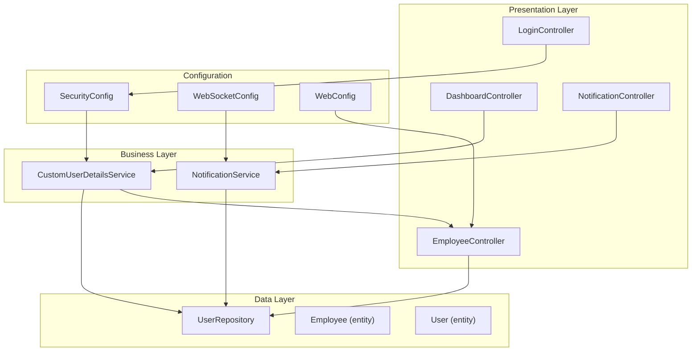
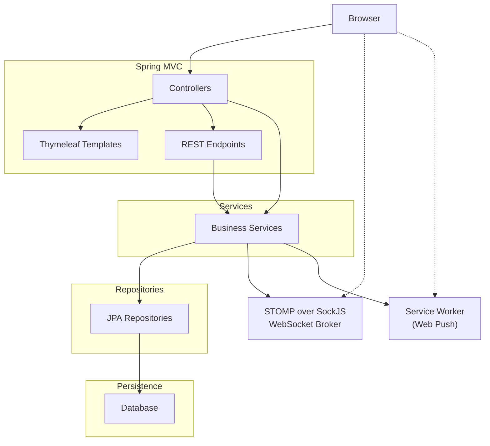
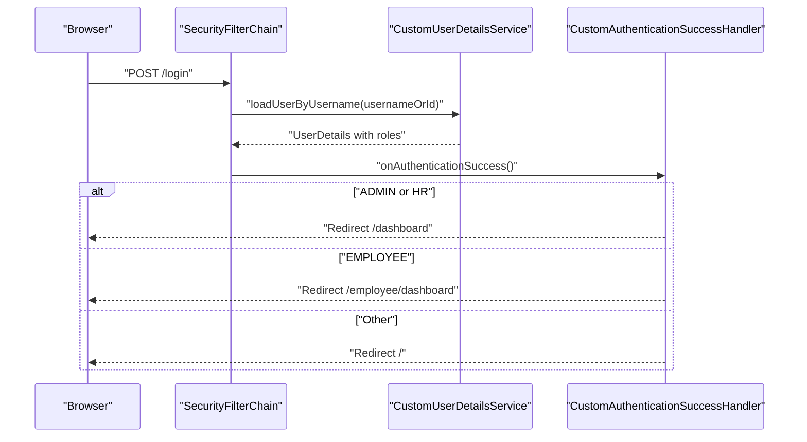
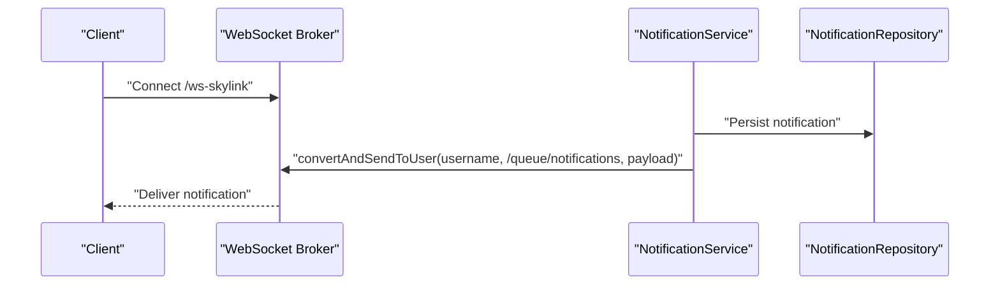
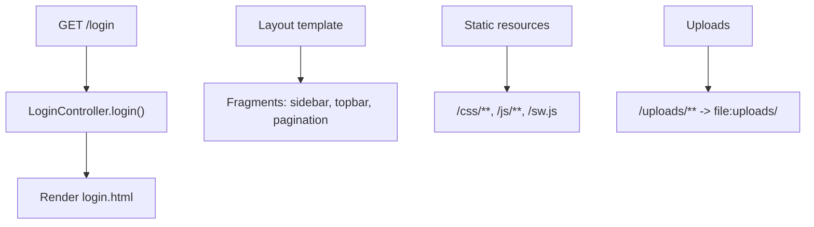
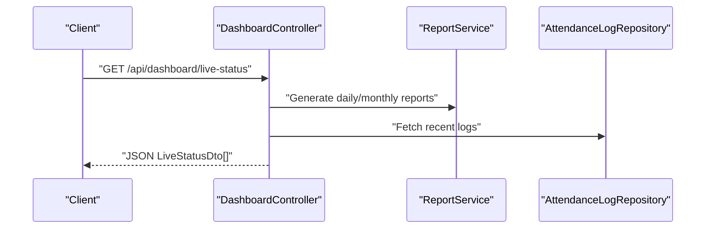
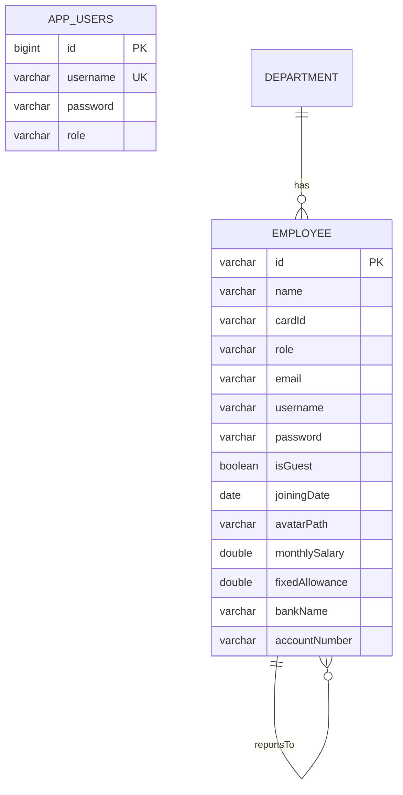
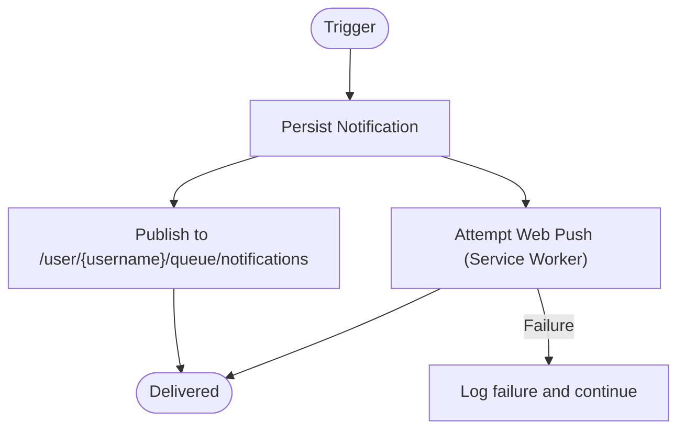
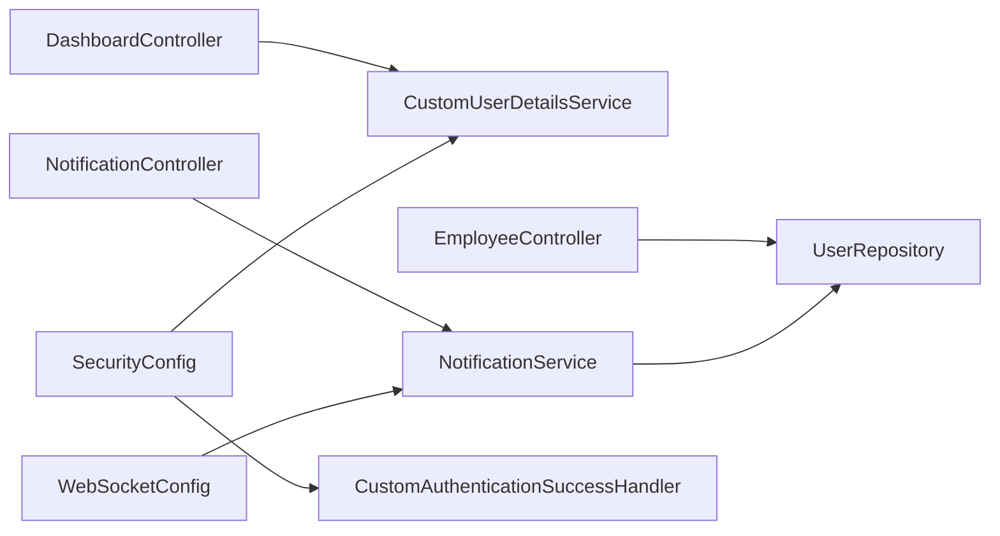

# Architecture and Design

<cite>
**Referenced Files in This Document**
- [AttendanceSystemApplication.java](file://src/main/java/root/cyb/mh/attendancesystem/AttendanceSystemApplication.java)
- [SecurityConfig.java](file://src/main/java/root/cyb/mh/attendancesystem/config/SecurityConfig.java)
- [CustomAuthenticationSuccessHandler.java](file://src/main/java/root/cyb/mh/attendancesystem/config/CustomAuthenticationSuccessHandler.java)
- [WebSocketConfig.java](file://src/main/java/root/cyb/mh/attendancesystem/config/WebSocketConfig.java)
- [WebConfig.java](file://src/main/java/root/cyb/mh/attendancesystem/config/WebConfig.java)
- [LoginController.java](file://src/main/java/root/cyb/mh/attendancesystem/controller/LoginController.java)
- [DashboardController.java](file://src/main/java/root/cyb/mh/attendancesystem/controller/DashboardController.java)
- [EmployeeController.java](file://src/main/java/root/cyb/mh/attendancesystem/controller/EmployeeController.java)
- [NotificationController.java](file://src/main/java/root/cyb/mh/attendancesystem/controller/NotificationController.java)
- [CustomUserDetailsService.java](file://src/main/java/root/cyb/mh/attendancesystem/service/CustomUserDetailsService.java)
- [NotificationService.java](file://src/main/java/root/cyb/mh/attendancesystem/service/NotificationService.java)
- [UserRepository.java](file://src/main/java/root/cyb/mh/attendancesystem/repository/UserRepository.java)
- [User.java](file://src/main/java/root/cyb/mh/attendancesystem/model/User.java)
- [Employee.java](file://src/main/java/root/cyb/mh/attendancesystem/model/Employee.java)
- [application.properties](file://src/main/resources/application.properties)
</cite>

## Table of Contents
1. [Introduction](#introduction)
2. [Project Structure](#project-structure)
3. [Core Components](#core-components)
4. [Architecture Overview](#architecture-overview)
5. [Detailed Component Analysis](#detailed-component-analysis)
6. [Dependency Analysis](#dependency-analysis)
7. [Performance Considerations](#performance-considerations)
8. [Troubleshooting Guide](#troubleshooting-guide)
9. [Conclusion](#conclusion)
10. [Appendices](#appendices)

## Introduction
This document describes the architecture and design of the Skylink Custom Backend system. It explains the layered architecture (presentation, business, data), Spring Boot MVC implementation, component interactions, and integration patterns. It also documents the security architecture with Spring Security, WebSocket real-time communication, Thymeleaf templating integration, and REST API design principles. Cross-cutting concerns such as authentication, authorization, and notification systems are covered, along with technical decisions, architectural patterns, and scalability considerations.

## Project Structure
The backend follows a conventional Spring Boot MVC structure with clear separation of concerns:
- Presentation layer: Controllers and Thymeleaf templates
- Business layer: Services implementing domain logic
- Data layer: JPA repositories backed by a database
- Configuration: Security, WebSocket, WebMVC, and timezone settings
- Models: JPA entities representing domain data

**Diagram sources**
- [LoginController.java:1-14](file://src/main/java/root/cyb/mh/attendancesystem/controller/LoginController.java#L1-L14)
- [DashboardController.java:1-331](file://src/main/java/root/cyb/mh/attendancesystem/controller/DashboardController.java#L1-L331)
- [EmployeeController.java:1-213](file://src/main/java/root/cyb/mh/attendancesystem/controller/EmployeeController.java#L1-L213)
- [NotificationController.java:1-49](file://src/main/java/root/cyb/mh/attendancesystem/controller/NotificationController.java#L1-L49)
- [CustomUserDetailsService.java:1-54](file://src/main/java/root/cyb/mh/attendancesystem/service/CustomUserDetailsService.java#L1-L54)
- [NotificationService.java:1-78](file://src/main/java/root/cyb/mh/attendancesystem/service/NotificationService.java#L1-L78)
- [UserRepository.java:1-12](file://src/main/java/root/cyb/mh/attendancesystem/repository/UserRepository.java#L1-L12)
- [User.java:1-24](file://src/main/java/root/cyb/mh/attendancesystem/model/User.java#L1-L24)
- [Employee.java:1-64](file://src/main/java/root/cyb/mh/attendancesystem/model/Employee.java#L1-L64)
- [SecurityConfig.java:1-91](file://src/main/java/root/cyb/mh/attendancesystem/config/SecurityConfig.java#L1-L91)
- [WebSocketConfig.java:1-26](file://src/main/java/root/cyb/mh/attendancesystem/config/WebSocketConfig.java#L1-L26)
- [WebConfig.java:1-18](file://src/main/java/root/cyb/mh/attendancesystem/config/WebConfig.java#L1-L18)

**Section sources**
- [AttendanceSystemApplication.java:1-16](file://src/main/java/root/cyb/mh/attendancesystem/AttendanceSystemApplication.java#L1-L16)
- [application.properties:1-1](file://src/main/resources/application.properties#L1-L1)

## Core Components
- Application bootstrap: Declares Spring Boot application and enables scheduling.
- Security: Centralized security filter chain with form login, remember-me, logout, and role-based authorization.
- Authentication provider: Custom user details service supporting both administrative users and employees.
- Real-time notifications: WebSocket broker and push notification service with database persistence.
- MVC controllers: Thymeleaf-backed controllers for dashboards, employees, and notifications; REST endpoints for live status.
- Static resource serving: Local upload directory exposure for file downloads.

**Section sources**
- [AttendanceSystemApplication.java:1-16](file://src/main/java/root/cyb/mh/attendancesystem/AttendanceSystemApplication.java#L1-L16)
- [SecurityConfig.java:1-91](file://src/main/java/root/cyb/mh/attendancesystem/config/SecurityConfig.java#L1-L91)
- [CustomUserDetailsService.java:1-54](file://src/main/java/root/cyb/mh/attendancesystem/service/CustomUserDetailsService.java#L1-L54)
- [NotificationService.java:1-78](file://src/main/java/root/cyb/mh/attendancesystem/service/NotificationService.java#L1-L78)
- [DashboardController.java:1-331](file://src/main/java/root/cyb/mh/attendancesystem/controller/DashboardController.java#L1-L331)
- [EmployeeController.java:1-213](file://src/main/java/root/cyb/mh/attendancesystem/controller/EmployeeController.java#L1-L213)
- [NotificationController.java:1-49](file://src/main/java/root/cyb/mh/attendancesystem/controller/NotificationController.java#L1-L49)
- [WebConfig.java:1-18](file://src/main/java/root/cyb/mh/attendancesystem/config/WebConfig.java#L1-L18)

## Architecture Overview
The system employs a layered architecture:
- Presentation: Spring MVC controllers render Thymeleaf views and expose REST endpoints.
- Business: Services encapsulate domain logic and coordinate repositories.
- Data: JPA repositories provide CRUD and query capabilities over entities.
- Integration: WebSocket broker for real-time updates and push notifications; upload resource handler for static assets.

**Diagram sources**
- [WebSocketConfig.java:1-26](file://src/main/java/root/cyb/mh/attendancesystem/config/WebSocketConfig.java#L1-L26)
- [NotificationService.java:1-78](file://src/main/java/root/cyb/mh/attendancesystem/service/NotificationService.java#L1-L78)
- [DashboardController.java:227-270](file://src/main/java/root/cyb/mh/attendancesystem/controller/DashboardController.java#L227-L270)
- [WebConfig.java:1-18](file://src/main/java/root/cyb/mh/attendancesystem/config/WebConfig.java#L1-L18)

## Detailed Component Analysis

### Security Architecture
- Role-based access control: Requests are authorized per endpoint patterns with roles ADMIN, HR, EMPLOYEE.
- Form login: Uses a custom success handler to redirect users and update employee daily status.
- Remember-me: Configured with a secret key and 7-day validity.
- Logout: Redirects to login with a logout parameter.
- CSRF: Disabled for simplicity given the project’s context and existing forms.

**Diagram sources**
- [SecurityConfig.java:18-84](file://src/main/java/root/cyb/mh/attendancesystem/config/SecurityConfig.java#L18-L84)
- [CustomUserDetailsService.java:24-52](file://src/main/java/root/cyb/mh/attendancesystem/service/CustomUserDetailsService.java#L24-L52)
- [CustomAuthenticationSuccessHandler.java:27-64](file://src/main/java/root/cyb/mh/attendancesystem/config/CustomAuthenticationSuccessHandler.java#L27-L64)

**Section sources**
- [SecurityConfig.java:1-91](file://src/main/java/root/cyb/mh/attendancesystem/config/SecurityConfig.java#L1-L91)
- [CustomUserDetailsService.java:1-54](file://src/main/java/root/cyb/mh/attendancesystem/service/CustomUserDetailsService.java#L1-L54)
- [CustomAuthenticationSuccessHandler.java:1-66](file://src/main/java/root/cyb/mh/attendancesystem/config/CustomAuthenticationSuccessHandler.java#L1-L66)

### WebSocket Real-Time Communication
- Broker: Simple broker for topics and queues; application destination prefix for app endpoints; user-specific destinations.
- Endpoint: STOMP endpoint exposed with SockJS fallback.
- Integration: Notification service publishes to user-specific queue and logs failures for web push.

**Diagram sources**
- [WebSocketConfig.java:14-24](file://src/main/java/root/cyb/mh/attendancesystem/config/WebSocketConfig.java#L14-L24)
- [NotificationService.java:22-44](file://src/main/java/root/cyb/mh/attendancesystem/service/NotificationService.java#L22-L44)

**Section sources**
- [WebSocketConfig.java:1-26](file://src/main/java/root/cyb/mh/attendancesystem/config/WebSocketConfig.java#L1-L26)
- [NotificationService.java:1-78](file://src/main/java/root/cyb/mh/attendancesystem/service/NotificationService.java#L1-L78)

### Thymeleaf Templating Integration
- Login page: Controller exposes GET /login mapped to the login template.
- Layout and fragments: Templates share common fragments (sidebar, topbar, pagination).
- Static resources: CSS, JS, and service worker served from static locations.
- Uploads: Local uploads directory exposed for file retrieval.

**Diagram sources**
- [LoginController.java:9-12](file://src/main/java/root/cyb/mh/attendancesystem/controller/LoginController.java#L9-L12)
- [WebConfig.java:11-16](file://src/main/java/root/cyb/mh/attendancesystem/config/WebConfig.java#L11-L16)

**Section sources**
- [LoginController.java:1-14](file://src/main/java/root/cyb/mh/attendancesystem/controller/LoginController.java#L1-L14)
- [WebConfig.java:1-18](file://src/main/java/root/cyb/mh/attendancesystem/config/WebConfig.java#L1-L18)

### REST API Design Principles
- REST endpoints are annotated with @RestController or @ResponseBody where applicable.
- Example: Live status endpoint returns a list of DTOs for real-time dashboards.
- Pagination and sorting are supported in controllers for list endpoints.
- Consistent use of ResponseEntity-returning methods is recommended for clarity.

**Diagram sources**
- [DashboardController.java:227-270](file://src/main/java/root/cyb/mh/attendancesystem/controller/DashboardController.java#L227-L270)

**Section sources**
- [DashboardController.java:227-270](file://src/main/java/root/cyb/mh/attendancesystem/controller/DashboardController.java#L227-L270)

### Data Model and Entities
- User entity: Administrative users with role-based access.
- Employee entity: Workers with login credentials, payroll, and reporting relationships.
- Repositories: JPA repositories for persistence and queries.

**Diagram sources**
- [User.java:1-24](file://src/main/java/root/cyb/mh/attendancesystem/model/User.java#L1-L24)
- [Employee.java:1-64](file://src/main/java/root/cyb/mh/attendancesystem/model/Employee.java#L1-L64)

**Section sources**
- [User.java:1-24](file://src/main/java/root/cyb/mh/attendancesystem/model/User.java#L1-L24)
- [Employee.java:1-64](file://src/main/java/root/cyb/mh/attendancesystem/model/Employee.java#L1-L64)
- [UserRepository.java:1-12](file://src/main/java/root/cyb/mh/attendancesystem/repository/UserRepository.java#L1-L12)

### Notification System
- Persistence: Notifications stored per recipient with read/unread state.
- Real-time delivery: WebSocket user-specific queue for immediate client updates.
- Web Push: Attempts to deliver via service worker; failures are logged and do not block DB/WebSocket writes.

**Diagram sources**
- [NotificationService.java:22-44](file://src/main/java/root/cyb/mh/attendancesystem/service/NotificationService.java#L22-L44)

**Section sources**
- [NotificationService.java:1-78](file://src/main/java/root/cyb/mh/attendancesystem/service/NotificationService.java#L1-L78)
- [NotificationController.java:1-49](file://src/main/java/root/cyb/mh/attendancesystem/controller/NotificationController.java#L1-L49)

## Dependency Analysis
- Controllers depend on services and repositories for business logic and persistence.
- Services depend on repositories and messaging facilities for orchestration.
- Security configuration depends on the custom authentication success handler and user details service.
- WebSocket configuration integrates with SimpMessagingTemplate for real-time updates.

**Diagram sources**
- [DashboardController.java:1-331](file://src/main/java/root/cyb/mh/attendancesystem/controller/DashboardController.java#L1-L331)
- [EmployeeController.java:1-213](file://src/main/java/root/cyb/mh/attendancesystem/controller/EmployeeController.java#L1-L213)
- [NotificationController.java:1-49](file://src/main/java/root/cyb/mh/attendancesystem/controller/NotificationController.java#L1-L49)
- [CustomUserDetailsService.java:1-54](file://src/main/java/root/cyb/mh/attendancesystem/service/CustomUserDetailsService.java#L1-L54)
- [NotificationService.java:1-78](file://src/main/java/root/cyb/mh/attendancesystem/service/NotificationService.java#L1-L78)
- [SecurityConfig.java:1-91](file://src/main/java/root/cyb/mh/attendancesystem/config/SecurityConfig.java#L1-L91)
- [CustomAuthenticationSuccessHandler.java:1-66](file://src/main/java/root/cyb/mh/attendancesystem/config/CustomAuthenticationSuccessHandler.java#L1-L66)
- [WebSocketConfig.java:1-26](file://src/main/java/root/cyb/mh/attendancesystem/config/WebSocketConfig.java#L1-L26)
- [UserRepository.java:1-12](file://src/main/java/root/cyb/mh/attendancesystem/repository/UserRepository.java#L1-L12)

**Section sources**
- [SecurityConfig.java:1-91](file://src/main/java/root/cyb/mh/attendancesystem/config/SecurityConfig.java#L1-L91)
- [CustomUserDetailsService.java:1-54](file://src/main/java/root/cyb/mh/attendancesystem/service/CustomUserDetailsService.java#L1-L54)
- [NotificationService.java:1-78](file://src/main/java/root/cyb/mh/attendancesystem/service/NotificationService.java#L1-L78)
- [WebSocketConfig.java:1-26](file://src/main/java/root/cyb/mh/attendancesystem/config/WebSocketConfig.java#L1-L26)
- [EmployeeController.java:1-213](file://src/main/java/root/cyb/mh/attendancesystem/controller/EmployeeController.java#L1-L213)
- [DashboardController.java:1-331](file://src/main/java/root/cyb/mh/attendancesystem/controller/DashboardController.java#L1-L331)
- [NotificationController.java:1-49](file://src/main/java/root/cyb/mh/attendancesystem/controller/NotificationController.java#L1-L49)

## Performance Considerations
- Dashboard computations: Aggregations over potentially large datasets; consider pagination and caching for frequently accessed metrics.
- Live status endpoint: Streams employee records and merges with report data; ensure efficient joins and indexing.
- WebSocket publishing: Keep payloads minimal; batch updates if necessary.
- Uploads: Expose only necessary directories; enforce file type and size limits at the controller level.
- Security: CSRF disabled for compatibility; evaluate enabling CSRF with proper form tokens for production hardening.

[No sources needed since this section provides general guidance]

## Troubleshooting Guide
- Authentication redirects: Verify role-based patterns and custom success handler logic for correct redirection.
- WebSocket connectivity: Confirm endpoint registration and user destination prefixes; check client-side subscription paths.
- Notification delivery: Inspect user-specific queue destinations and ensure recipients are properly identified.
- Static resources: Validate resource handlers and file system permissions for uploads directory.

**Section sources**
- [CustomAuthenticationSuccessHandler.java:27-64](file://src/main/java/root/cyb/mh/attendancesystem/config/CustomAuthenticationSuccessHandler.java#L27-L64)
- [WebSocketConfig.java:14-24](file://src/main/java/root/cyb/mh/attendancesystem/config/WebSocketConfig.java#L14-L24)
- [NotificationService.java:33-44](file://src/main/java/root/cyb/mh/attendancesystem/service/NotificationService.java#L33-L44)
- [WebConfig.java:11-16](file://src/main/java/root/cyb/mh/attendancesystem/config/WebConfig.java#L11-L16)

## Conclusion
The Skylink Custom Backend leverages a clean layered architecture with Spring MVC, JPA, and Spring Security. It integrates Thymeleaf for server-rendered pages and WebSocket for real-time notifications, while exposing REST endpoints for live dashboards. Security is role-based with a custom authentication flow, and cross-cutting concerns are addressed through dedicated services and configuration. Scalability can be improved with caching, pagination, and stricter CSRF enforcement.

[No sources needed since this section summarizes without analyzing specific files]

## Appendices
- Profiles: Active profile is set to prod; ensure environment-specific properties are configured accordingly.

**Section sources**
- [application.properties:1-1](file://src/main/resources/application.properties#L1-L1)