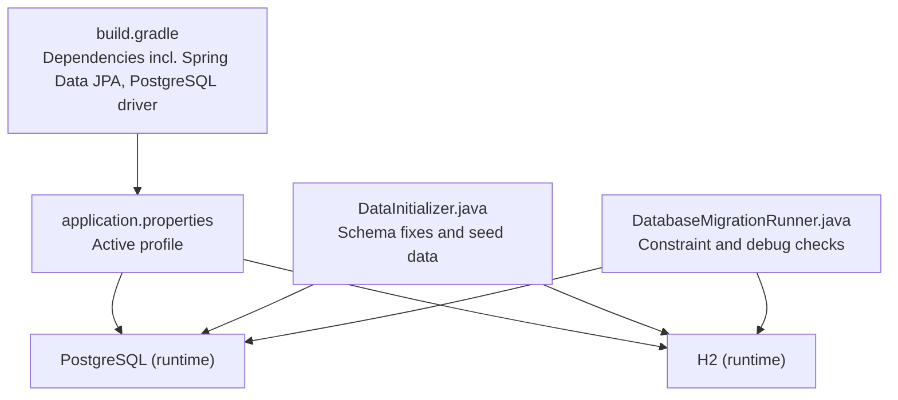
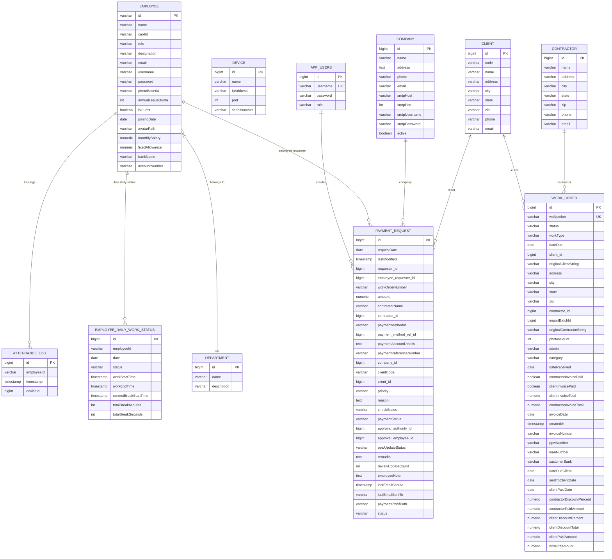
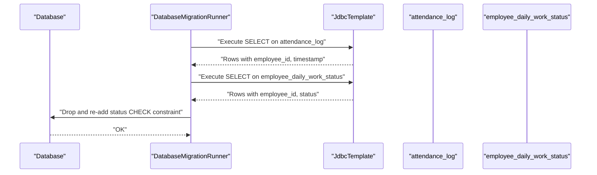
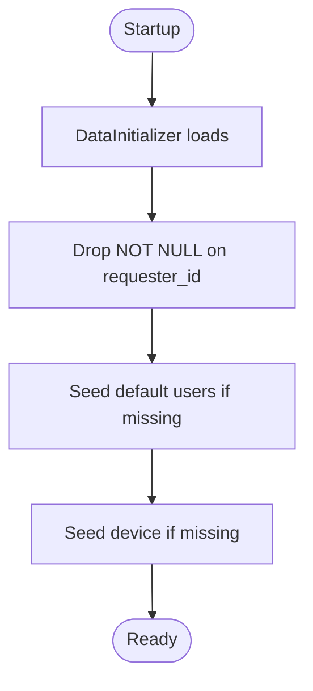
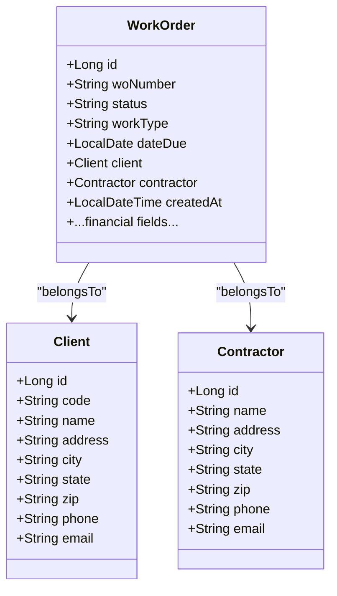
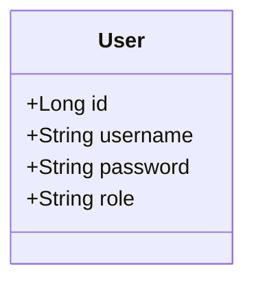
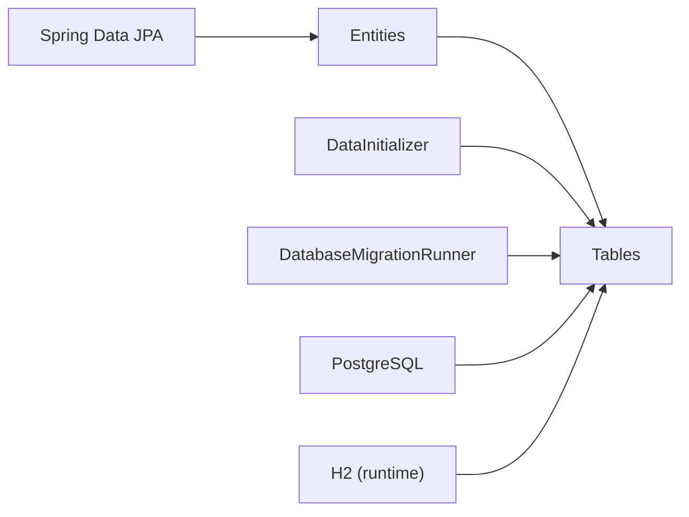

# Database Design

<cite>
**Referenced Files in This Document**
- [build.gradle](file://build.gradle)
- [application.properties](file://src/main/resources/application.properties)
- [DatabaseMigrationRunner.java](file://src/main/java/root/cyb/mh/attendancesystem/config/DatabaseMigrationRunner.java)
- [DataInitializer.java](file://src/main/java/root/cyb/mh/attendancesystem/config/DataInitializer.java)
- [Employee.java](file://src/main/java/root/cyb/mh/attendancesystem/model/Employee.java)
- [Company.java](file://src/main/java/root/cyb/mh/attendancesystem/model/Company.java)
- [Department.java](file://src/main/java/root/cyb/mh/attendancesystem/model/Department.java)
- [User.java](file://src/main/java/root/cyb/mh/attendancesystem/model/User.java)
- [Device.java](file://src/main/java/root/cyb/mh/attendancesystem/model/Device.java)
- [AttendanceLog.java](file://src/main/java/root/cyb/mh/attendancesystem/model/AttendanceLog.java)
- [EmployeeDailyWorkStatus.java](file://src/main/java/root/cyb/mh/attendancesystem/model/EmployeeDailyWorkStatus.java)
- [WorkOrder.java](file://src/main/java/root/cyb/mh/attendancesystem/model/WorkOrder.java)
- [PaymentRequest.java](file://src/main/java/root/cyb/mh/attendancesystem/model/PaymentRequest.java)
- [WorkStatus.java](file://src/main/java/root/cyb/mh/attendancesystem/model/WorkStatus.java)
</cite>

## Table of Contents
1. [Introduction](#introduction)
2. [Project Structure](#project-structure)
3. [Core Components](#core-components)
4. [Architecture Overview](#architecture-overview)
5. [Detailed Component Analysis](#detailed-component-analysis)
6. [Dependency Analysis](#dependency-analysis)
7. [Performance Considerations](#performance-considerations)
8. [Troubleshooting Guide](#troubleshooting-guide)
9. [Conclusion](#conclusion)
10. [Appendices](#appendices)

## Introduction
This document describes the database design for the Skylink Custom Backend. It covers entity relationships, schema, JPA annotations, indexing strategies, constraints, and operational considerations. It also documents migration and initialization scripts, schema evolution, and performance tuning recommendations derived from the codebase.

## Project Structure
The backend uses Spring Boot with Spring Data JPA and supports both H2 (in-memory) and PostgreSQL databases. Profiles are configured via application properties, and database initialization and migrations are handled programmatically during startup.

**Diagram sources**
- [build.gradle:34-54](file://build.gradle#L34-L54)
- [application.properties:1-1](file://src/main/resources/application.properties#L1-L1)
- [DataInitializer.java:18-31](file://src/main/java/root/cyb/mh/attendancesystem/config/DataInitializer.java#L18-L31)
- [DatabaseMigrationRunner.java:14-41](file://src/main/java/root/cyb/mh/attendancesystem/config/DatabaseMigrationRunner.java#L14-L41)

**Section sources**
- [build.gradle:1-60](file://build.gradle#L1-L60)
- [application.properties:1-1](file://src/main/resources/application.properties#L1-L1)

## Core Components
This section outlines the core entities and their JPA annotations, primary keys, and relationships inferred from the code.

- Employee
  - Primary key: id (String)
  - Relationships: Many-to-one to Department, self-referencing to reportsTo and reportsToAssistant
  - Notes: Uses Lombok @Data/@NoArgsConstructor/@AllArgsConstructor; includes payroll and bank fields

- Department
  - Primary key: id (Long, auto-generated)
  - Attributes: name, description

- Company
  - Primary key: id (Long, auto-generated)
  - Attributes: name (not null), address (TEXT), contact info, SMTP settings, active flag

- User
  - Primary key: id (Long, auto-generated)
  - Unique constraints: username
  - Attributes: username (unique, not null), password (not null), role (not null)
  - Note: Table named app_users to avoid reserved keyword conflicts

- Device
  - Primary key: id (Long, auto-generated)
  - Attributes: name, ipAddress, port, serialNumber

- AttendanceLog
  - Primary key: id (Long, auto-generated)
  - Attributes: employeeId (String), timestamp (LocalDateTime), deviceId (Long)

- EmployeeDailyWorkStatus
  - Primary key: id (Long, auto-generated)
  - Composite natural key concept: employeeId + date
  - Enumerated status field mapped to STRING
  - Attributes: status (default NOT_ENTERED), timestamps, break durations

- WorkOrder
  - Primary key: id (Long, auto-generated)
  - Unique constraints: woNumber (not null)
  - Relationships: Many-to-one to Client and Contractor via foreign keys
  - Attributes: dates, financials, addresses, metadata, createdAt (updatable=false)

- PaymentRequest
  - Primary key: id (Long, auto-generated)
  - Relationships: Many-to-one to User (requester), Employee (employee_requester), Contractor, PaymentMethod, Company, Client
  - Attributes: amounts, priorities, statuses, timestamps, references, and optional requester_id drop-NOT-NULL fix applied at runtime

- WorkStatus (enum)
  - Values: NOT_ENTERED, ENTERED_OFFICE, LOGGED_IN, WORKING, ON_BREAK, ENDED_WORK, LEFT_WITHOUT_PUNCH, COMPLETED_DAY, INCOMPLETE_SHIFT

**Section sources**
- [Employee.java:13-63](file://src/main/java/root/cyb/mh/attendancesystem/model/Employee.java#L13-L63)
- [Department.java:15-21](file://src/main/java/root/cyb/mh/attendancesystem/model/Department.java#L15-L21)
- [Company.java:8-30](file://src/main/java/root/cyb/mh/attendancesystem/model/Company.java#L8-L30)
- [User.java:6-23](file://src/main/java/root/cyb/mh/attendancesystem/model/User.java#L6-L23)
- [Device.java:11-25](file://src/main/java/root/cyb/mh/attendancesystem/model/Device.java#L11-L25)
- [AttendanceLog.java:13-26](file://src/main/java/root/cyb/mh/attendancesystem/model/AttendanceLog.java#L13-L26)
- [EmployeeDailyWorkStatus.java:9-44](file://src/main/java/root/cyb/mh/attendancesystem/model/EmployeeDailyWorkStatus.java#L9-L44)
- [WorkOrder.java:8-108](file://src/main/java/root/cyb/mh/attendancesystem/model/WorkOrder.java#L8-L108)
- [PaymentRequest.java:13-116](file://src/main/java/root/cyb/mh/attendancesystem/model/PaymentRequest.java#L13-L116)
- [WorkStatus.java:3-13](file://src/main/java/root/cyb/mh/attendancesystem/model/WorkStatus.java#L3-L13)

## Architecture Overview
The database architecture centers around attendance, workforce, and financial workflows. Entities are connected via foreign keys and enums, with explicit constraints and defaults.

**Diagram sources**
- [Employee.java:22-29](file://src/main/java/root/cyb/mh/attendancesystem/model/Employee.java#L22-L29)
- [AttendanceLog.java:23-25](file://src/main/java/root/cyb/mh/attendancesystem/model/AttendanceLog.java#L23-L25)
- [EmployeeDailyWorkStatus.java:18-19](file://src/main/java/root/cyb/mh/attendancesystem/model/EmployeeDailyWorkStatus.java#L18-L19)
- [WorkOrder.java:24-37](file://src/main/java/root/cyb/mh/attendancesystem/model/WorkOrder.java#L24-L37)
- [PaymentRequest.java:33-58](file://src/main/java/root/cyb/mh/attendancesystem/model/PaymentRequest.java#L33-L58)
- [User.java:8-22](file://src/main/java/root/cyb/mh/attendancesystem/model/User.java#L8-L22)
- [Company.java:8-30](file://src/main/java/root/cyb/mh/attendancesystem/model/Company.java#L8-L30)

## Detailed Component Analysis

### Attendance and Work Status
- AttendanceLog captures punch events with employeeId, timestamp, and deviceId.
- EmployeeDailyWorkStatus tracks daily status per employee with composite natural key semantics (employeeId + date) and enumerated status values.

**Diagram sources**
- [DatabaseMigrationRunner.java:14-41](file://src/main/java/root/cyb/mh/attendancesystem/config/DatabaseMigrationRunner.java#L14-L41)

**Section sources**
- [AttendanceLog.java:13-26](file://src/main/java/root/cyb/mh/attendancesystem/model/AttendanceLog.java#L13-L26)
- [EmployeeDailyWorkStatus.java:9-44](file://src/main/java/root/cyb/mh/attendancesystem/model/EmployeeDailyWorkStatus.java#L9-L44)
- [DatabaseMigrationRunner.java:14-41](file://src/main/java/root/cyb/mh/attendancesystem/config/DatabaseMigrationRunner.java#L14-L41)

### Payment Requests and Schema Evolution
- PaymentRequest defines multiple relationships and uses enumerated fields for statuses/priorities.
- A runtime schema fix drops NOT NULL on requester_id in payment_requests to support legacy data.

**Diagram sources**
- [DataInitializer.java:18-31](file://src/main/java/root/cyb/mh/attendancesystem/config/DataInitializer.java#L18-L31)

**Section sources**
- [PaymentRequest.java:13-116](file://src/main/java/root/cyb/mh/attendancesystem/model/PaymentRequest.java#L13-L116)
- [DataInitializer.java:18-31](file://src/main/java/root/cyb/mh/attendancesystem/config/DataInitializer.java#L18-L31)

### Work Orders and Clients/Contractors
- WorkOrder has a unique work order number and links to Client and Contractor.
- Financial and administrative fields support invoicing and reporting.

**Diagram sources**
- [WorkOrder.java:10-37](file://src/main/java/root/cyb/mh/attendancesystem/model/WorkOrder.java#L10-L37)

**Section sources**
- [WorkOrder.java:10-108](file://src/main/java/root/cyb/mh/attendancesystem/model/WorkOrder.java#L10-L108)

### Users and Authentication
- User entity stores credentials and roles, with unique username enforced at the database level.

**Diagram sources**
- [User.java:6-23](file://src/main/java/root/cyb/mh/attendancesystem/model/User.java#L6-L23)

**Section sources**
- [User.java:6-23](file://src/main/java/root/cyb/mh/attendancesystem/model/User.java#L6-L23)

## Dependency Analysis
- JPA/Hibernate manages persistence for all entities.
- PostgreSQL is the primary runtime database; H2 is included for development/testing.
- Initialization and migration scripts adjust schema and seed data at startup.

**Diagram sources**
- [build.gradle:34-54](file://build.gradle#L34-L54)
- [DataInitializer.java:18-31](file://src/main/java/root/cyb/mh/attendancesystem/config/DataInitializer.java#L18-L31)
- [DatabaseMigrationRunner.java:14-41](file://src/main/java/root/cyb/mh/attendancesystem/config/DatabaseMigrationRunner.java#L14-L41)

**Section sources**
- [build.gradle:34-54](file://build.gradle#L34-L54)

## Performance Considerations
- Indexing strategies
  - Primary keys are implicitly indexed by the RDBMS.
  - Consider adding indexes on frequently filtered/sorted columns:
    - AttendanceLog.employeeId and timestamp
    - EmployeeDailyWorkStatus.employeeId + date
    - PaymentRequest.workOrderNumber, requester_id, employee_requester_id, contractor_id, client_id, company_id
    - WorkOrder.woNumber, client_id, contractor_id, createdAt
    - User.username (already unique)
- Query patterns
  - Daily status lookup by employeeId + date
  - AttendanceLog queries by date range and employeeId
  - PaymentRequest and WorkOrder filtering by foreign keys and dates
- Data types and defaults
  - Numeric fields for monetary values; TEXT for long-form notes
  - Defaults for integer counters and booleans reduce NULL checks
- Concurrency and transactions
  - Use appropriate transaction isolation levels for concurrent updates to daily status and payment requests
- Batch operations
  - Bulk import/export paths may benefit from batch inserts and streaming reads

[No sources needed since this section provides general guidance]

## Troubleshooting Guide
- Constraint violations on work status
  - A startup routine ensures the status CHECK constraint exists; re-apply it if missing
- Schema compatibility for payment_requests
  - requester_id may be altered to allow NULL to accommodate legacy data
- Startup diagnostics
  - Migration runner prints recent attendance logs and daily statuses to console for quick verification

**Section sources**
- [DatabaseMigrationRunner.java:14-41](file://src/main/java/root/cyb/mh/attendancesystem/config/DatabaseMigrationRunner.java#L14-L41)
- [DataInitializer.java:18-31](file://src/main/java/root/cyb/mh/attendancesystem/config/DataInitializer.java#L18-L31)

## Conclusion
The Skylink Custom Backend employs a normalized relational schema with clear entity relationships and constraints. JPA annotations define primary keys, enumerations, and defaults, while programmatic initialization and migration routines maintain schema integrity across environments. Indexing and query tuning should target high-traffic paths such as daily status lookups, attendance queries, and foreign-key filtered lists.

[No sources needed since this section summarizes without analyzing specific files]

## Appendices

### Appendix A: Notable JPA Annotations and Constraints
- @Entity, @Id, @GeneratedValue
- @Table(name = "...") for reserved keywords
- @Column(unique = true, nullable = false)
- @Enumerated(EnumType.STRING)
- @ManyToOne + @JoinColumn for foreign keys
- @PrePersist for createdAt defaults
- ColumnDefinition defaults for integers and booleans

**Section sources**
- [User.java:8-22](file://src/main/java/root/cyb/mh/attendancesystem/model/User.java#L8-L22)
- [WorkOrder.java:65-90](file://src/main/java/root/cyb/mh/attendancesystem/model/WorkOrder.java#L65-L90)
- [EmployeeDailyWorkStatus.java:30-38](file://src/main/java/root/cyb/mh/attendancesystem/model/EmployeeDailyWorkStatus.java#L30-L38)
- [PaymentRequest.java:27-31](file://src/main/java/root/cyb/mh/attendancesystem/model/PaymentRequest.java#L27-L31)

### Appendix B: Runtime Dependencies and Profiles
- PostgreSQL driver is active at runtime
- H2 is present for development/testing
- Active profile is prod by default

**Section sources**
- [build.gradle:46-47](file://build.gradle#L46-L47)
- [application.properties:1-1](file://src/main/resources/application.properties#L1-L1)