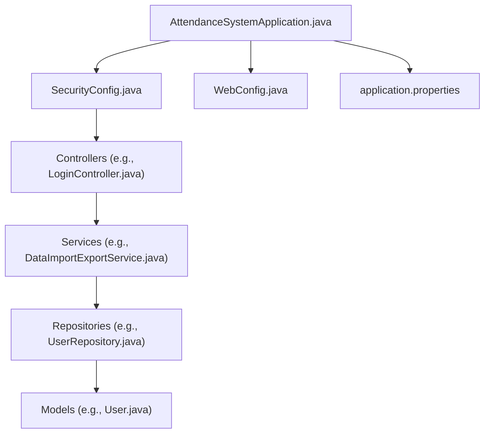
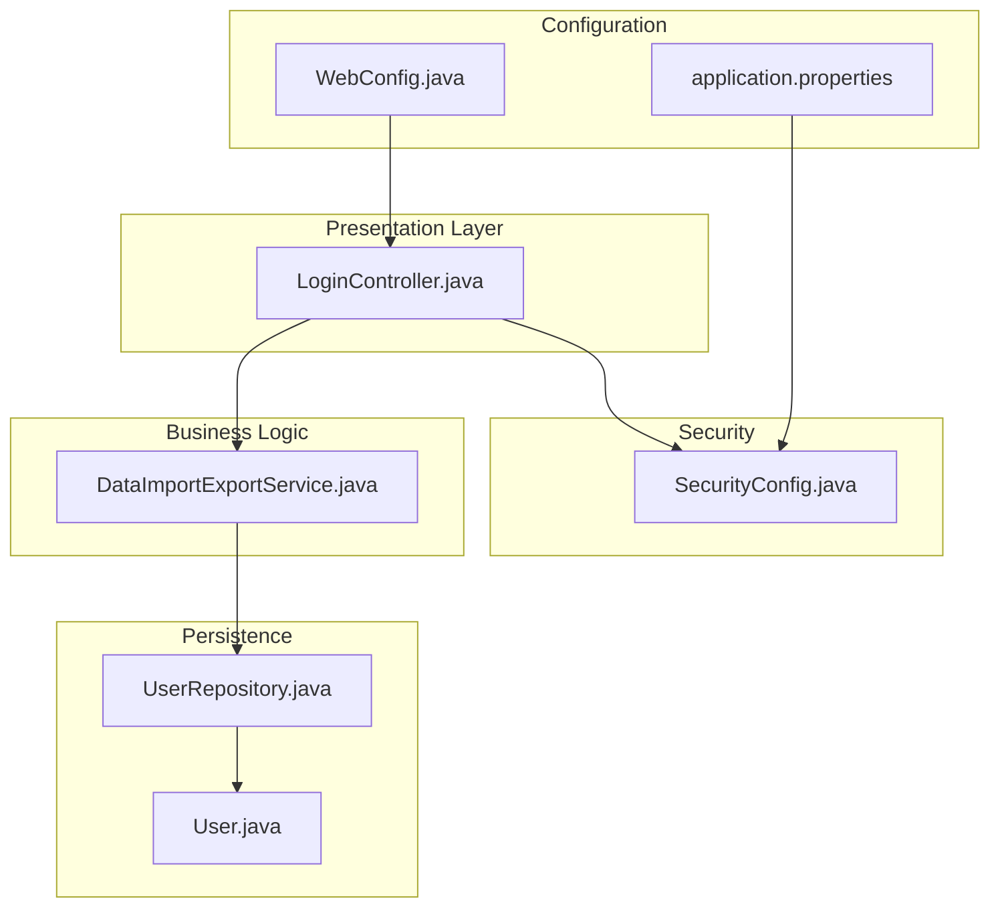
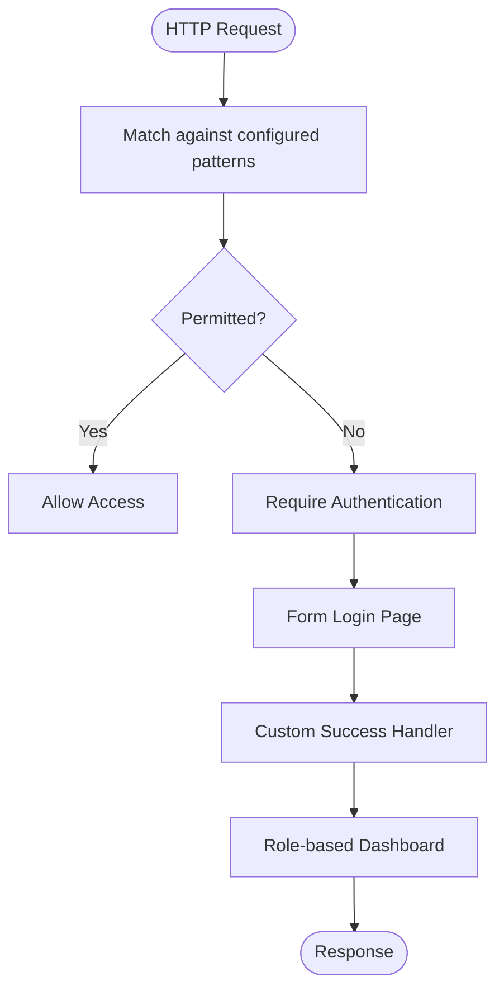
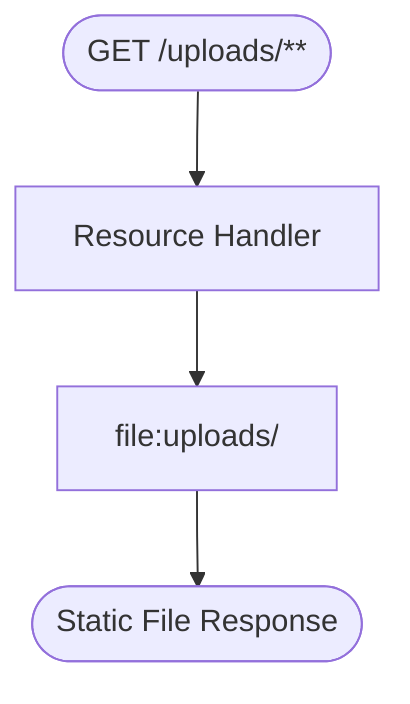
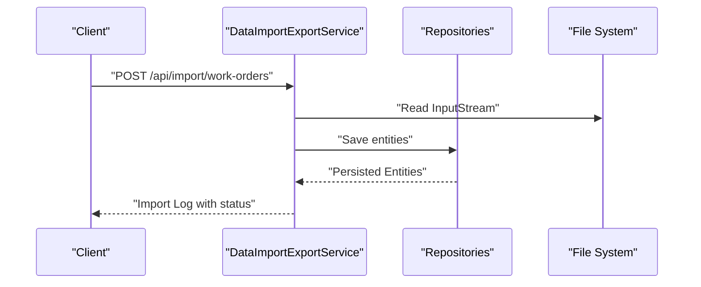
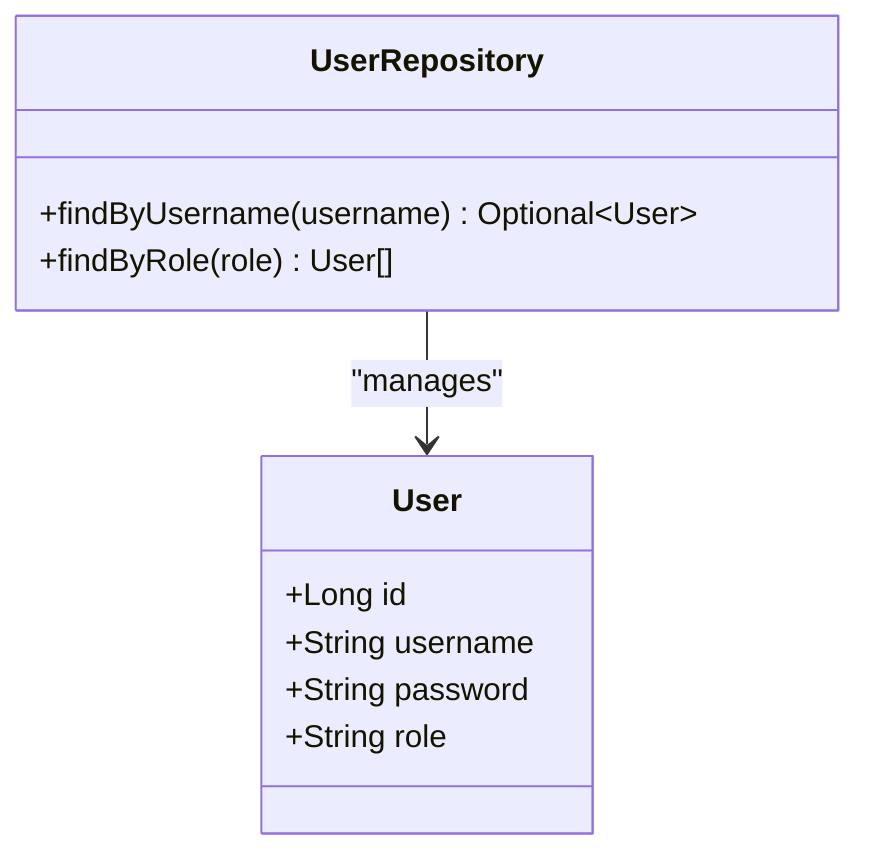
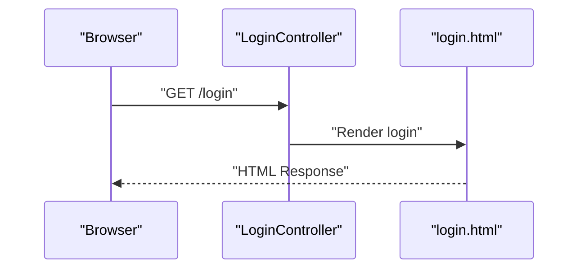
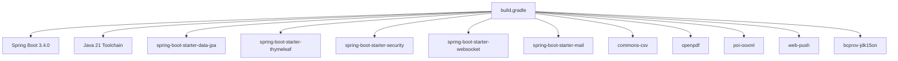

# Developer Guidelines

<cite>
**Referenced Files in This Document**
- [README.md](file://README.md)
- [build.gradle](file://build.gradle)
- [settings.gradle](file://settings.gradle)
- [gradle-wrapper.properties](file://gradle/wrapper/gradle-wrapper.properties)
- [AttendanceSystemApplication.java](file://src/main/java/root/cyb/mh/attendancesystem/AttendanceSystemApplication.java)
- [SecurityConfig.java](file://src/main/java/root/cyb/mh/attendancesystem/config/SecurityConfig.java)
- [WebConfig.java](file://src/main/java/root/cyb/mh/attendancesystem/config/WebConfig.java)
- [LoginController.java](file://src/main/java/root/cyb/mh/attendancesystem/controller/LoginController.java)
- [DataImportExportService.java](file://src/main/java/root/cyb/mh/attendancesystem/service/DataImportExportService.java)
- [User.java](file://src/main/java/root/cyb/mh/attendancesystem/model/User.java)
- [UserRepository.java](file://src/main/java/root/cyb/mh/attendancesystem/repository/UserRepository.java)
- [application.properties](file://src/main/resources/application.properties)
- [.gitignore](file://.gitignore)
- [AttendanceSystemApplicationTests.java](file://src/test/java/root/cyb/mh/attendancesystem/AttendanceSystemApplicationTests.java)
- [PaymentRequestControllerTest.java](file://src/test/java/root/cyb/mh/attendancesystem/PaymentRequestControllerTest.java)
</cite>

## Table of Contents
1. [Introduction](#introduction)
2. [Project Structure](#project-structure)
3. [Core Components](#core-components)
4. [Architecture Overview](#architecture-overview)
5. [Detailed Component Analysis](#detailed-component-analysis)
6. [Dependency Analysis](#dependency-analysis)
7. [Performance Considerations](#performance-considerations)
8. [Troubleshooting Guide](#troubleshooting-guide)
9. [Development Workflow](#development-workflow)
10. [Branching Strategy](#branching-strategy)
11. [Code Review Process](#code-review-process)
12. [Contribution Guidelines](#contribution-guidelines)
13. [Development Environment Setup](#development-environment-setup)
14. [Coding Conventions](#coding-conventions)
15. [Testing Requirements](#testing-requirements)
16. [Documentation Standards](#documentation-standards)
17. [Code Quality Tools and Static Analysis](#code-quality-tools-and-static-analysis)
18. [Continuous Integration Requirements](#continuous-integration-requirements)
19. [Practical Examples](#practical-examples)
20. [Conclusion](#conclusion)

## Introduction
This document provides comprehensive developer guidelines for the Skylink Custom Backend, a Spring Boot-based HR and Attendance Management System. It covers development workflow, branching strategy, code review, contribution guidelines, environment setup, coding conventions, testing, documentation, code quality tools, static analysis, and CI requirements. The goal is to ensure consistent, maintainable, and secure development across the team.

## Project Structure
The backend follows a layered Spring Boot architecture:
- Application bootstrap and scheduling enablement
- Configuration for security, web, and WebSocket
- Controllers for HTTP and Thymeleaf templates
- Services for business logic and integrations (PDF/CSV exports)
- Repositories for persistence via Spring Data JPA
- Models for JPA entities
- Resources for templates and configuration

**Diagram sources**
- [AttendanceSystemApplication.java:1-16](file://src/main/java/root/cyb/mh/attendancesystem/AttendanceSystemApplication.java#L1-L16)
- [SecurityConfig.java:1-91](file://src/main/java/root/cyb/mh/attendancesystem/config/SecurityConfig.java#L1-L91)
- [WebConfig.java:1-18](file://src/main/java/root/cyb/mh/attendancesystem/config/WebConfig.java#L1-L18)
- [LoginController.java:1-14](file://src/main/java/root/cyb/mh/attendancesystem/controller/LoginController.java#L1-L14)
- [DataImportExportService.java:1-800](file://src/main/java/root/cyb/mh/attendancesystem/service/DataImportExportService.java#L1-L800)
- [UserRepository.java:1-12](file://src/main/java/root/cyb/mh/attendancesystem/repository/UserRepository.java#L1-L12)
- [User.java:1-24](file://src/main/java/root/cyb/mh/attendancesystem/model/User.java#L1-L24)
- [application.properties:1-1](file://src/main/resources/application.properties#L1-L1)

**Section sources**
- [README.md:81-88](file://README.md#L81-L88)
- [AttendanceSystemApplication.java:1-16](file://src/main/java/root/cyb/mh/attendancesystem/AttendanceSystemApplication.java#L1-L16)
- [SecurityConfig.java:1-91](file://src/main/java/root/cyb/mh/attendancesystem/config/SecurityConfig.java#L1-L91)
- [WebConfig.java:1-18](file://src/main/java/root/cyb/mh/attendancesystem/config/WebConfig.java#L1-L18)
- [LoginController.java:1-14](file://src/main/java/root/cyb/mh/attendancesystem/controller/LoginController.java#L1-L14)
- [DataImportExportService.java:1-800](file://src/main/java/root/cyb/mh/attendancesystem/service/DataImportExportService.java#L1-L800)
- [UserRepository.java:1-12](file://src/main/java/root/cyb/mh/attendancesystem/repository/UserRepository.java#L1-L12)
- [User.java:1-24](file://src/main/java/root/cyb/mh/attendancesystem/model/User.java#L1-L24)
- [application.properties:1-1](file://src/main/resources/application.properties#L1-L1)

## Core Components
- Application bootstrap enables scheduling and sets the main class.
- Security configuration defines role-based access, form login, remember-me, and CSRF policy.
- Web configuration exposes local upload resources.
- Controllers handle login and template-driven endpoints.
- Services encapsulate business logic including CSV/Excel/PDF export and import workflows.
- Repositories provide JPA access for entities.
- Models define JPA entities with Lombok support.
- Tests demonstrate context loading and controller endpoint verification.

**Section sources**
- [AttendanceSystemApplication.java:1-16](file://src/main/java/root/cyb/mh/attendancesystem/AttendanceSystemApplication.java#L1-L16)
- [SecurityConfig.java:1-91](file://src/main/java/root/cyb/mh/attendancesystem/config/SecurityConfig.java#L1-L91)
- [WebConfig.java:1-18](file://src/main/java/root/cyb/mh/attendancesystem/config/WebConfig.java#L1-L18)
- [LoginController.java:1-14](file://src/main/java/root/cyb/mh/attendancesystem/controller/LoginController.java#L1-L14)
- [DataImportExportService.java:1-800](file://src/main/java/root/cyb/mh/attendancesystem/service/DataImportExportService.java#L1-L800)
- [UserRepository.java:1-12](file://src/main/java/root/cyb/mh/attendancesystem/repository/UserRepository.java#L1-L12)
- [User.java:1-24](file://src/main/java/root/cyb/mh/attendancesystem/model/User.java#L1-L24)
- [AttendanceSystemApplicationTests.java:1-14](file://src/test/java/root/cyb/mh/attendancesystem/AttendanceSystemApplicationTests.java#L1-L14)
- [PaymentRequestControllerTest.java:1-34](file://src/test/java/root/cyb/mh/attendancesystem/PaymentRequestControllerTest.java#L1-L34)

## Architecture Overview
The system uses Spring MVC with Thymeleaf for server-side rendering and Spring Security for authentication and authorization. Controllers delegate to services, which operate on repositories backed by JPA/Hibernate. The application supports real-time features via WebSocket and integrates with PDF and CSV libraries for reporting.

**Diagram sources**
- [LoginController.java:1-14](file://src/main/java/root/cyb/mh/attendancesystem/controller/LoginController.java#L1-L14)
- [SecurityConfig.java:1-91](file://src/main/java/root/cyb/mh/attendancesystem/config/SecurityConfig.java#L1-L91)
- [DataImportExportService.java:1-800](file://src/main/java/root/cyb/mh/attendancesystem/service/DataImportExportService.java#L1-L800)
- [UserRepository.java:1-12](file://src/main/java/root/cyb/mh/attendancesystem/repository/UserRepository.java#L1-L12)
- [User.java:1-24](file://src/main/java/root/cyb/mh/attendancesystem/model/User.java#L1-L24)
- [WebConfig.java:1-18](file://src/main/java/root/cyb/mh/attendancesystem/config/WebConfig.java#L1-L18)
- [application.properties:1-1](file://src/main/resources/application.properties#L1-L1)

## Detailed Component Analysis

### Security Configuration
SecurityConfig establishes:
- Permit-all for static assets and login/error endpoints
- Role-based authorization for admin, HR, employee, and supervisor areas
- Form login with a custom success handler and remember-me
- Logout configuration
- CSRF disabled for simplicity in the current context

**Diagram sources**
- [SecurityConfig.java:18-84](file://src/main/java/root/cyb/mh/attendancesystem/config/SecurityConfig.java#L18-L84)

**Section sources**
- [SecurityConfig.java:1-91](file://src/main/java/root/cyb/mh/attendancesystem/config/SecurityConfig.java#L1-L91)

### Web Configuration
WebConfig exposes local uploads directory for static resource serving.

**Diagram sources**
- [WebConfig.java:10-16](file://src/main/java/root/cyb/mh/attendancesystem/config/WebConfig.java#L10-L16)

**Section sources**
- [WebConfig.java:1-18](file://src/main/java/root/cyb/mh/attendancesystem/config/WebConfig.java#L1-L18)

### Data Import/Export Service
DataImportExportService provides:
- CSV export methods for entities
- CSV import methods for entities
- Payment request CSV/PDF export
- Invoice PDF generation
- Transactional import logging

**Diagram sources**
- [DataImportExportService.java:750-800](file://src/main/java/root/cyb/mh/attendancesystem/service/DataImportExportService.java#L750-L800)

**Section sources**
- [DataImportExportService.java:1-800](file://src/main/java/root/cyb/mh/attendancesystem/service/DataImportExportService.java#L1-L800)

### Entity and Repository Example
User entity and UserRepository demonstrate JPA usage with Lombok.

**Diagram sources**
- [User.java:1-24](file://src/main/java/root/cyb/mh/attendancesystem/model/User.java#L1-L24)
- [UserRepository.java:1-12](file://src/main/java/root/cyb/mh/attendancesystem/repository/UserRepository.java#L1-L12)

**Section sources**
- [User.java:1-24](file://src/main/java/root/cyb/mh/attendancesystem/model/User.java#L1-L24)
- [UserRepository.java:1-12](file://src/main/java/root/cyb/mh/attendancesystem/repository/UserRepository.java#L1-L12)

### Controller Example
LoginController maps the login page endpoint to a Thymeleaf template.

**Diagram sources**
- [LoginController.java:9-12](file://src/main/java/root/cyb/mh/attendancesystem/controller/LoginController.java#L9-L12)

**Section sources**
- [LoginController.java:1-14](file://src/main/java/root/cyb/mh/attendancesystem/controller/LoginController.java#L1-L14)

## Dependency Analysis
The project uses Gradle with Spring Boot 3.4.0 and Java 21. Dependencies include Spring Data JPA, Thymeleaf, Spring Security, WebSocket, mail, OpenPDF, Apache POI, Commons CSV, web-push, and BCrypt.

**Diagram sources**
- [build.gradle:1-60](file://build.gradle#L1-L60)

**Section sources**
- [build.gradle:1-60](file://build.gradle#L1-L60)
- [settings.gradle:1-2](file://settings.gradle#L1-L2)
- [gradle-wrapper.properties:1-8](file://gradle/wrapper/gradle-wrapper.properties#L1-L8)

## Performance Considerations
- Prefer streaming for large CSV/PDF exports to reduce memory overhead.
- Use pagination in repository queries for large datasets.
- Minimize DTO projections to reduce payload sizes.
- Cache infrequent static assets and leverage browser caching headers.
- Keep CSRF disabled only if forms are Thymeleaf-based; otherwise enable CSRF and ensure tokens are included.

## Troubleshooting Guide
Common issues and resolutions:
- Database connectivity: Verify PostgreSQL is running and credentials in application properties are correct.
- Port conflicts: Change server.port in application properties if 8083 is in use.
- Uploads not served: Confirm the uploads directory exists and WebConfig resource mapping is correct.
- Authentication failures: Ensure roles are set correctly in User entities and SecurityConfig patterns match URLs.
- Test failures: Run tests with ./gradlew test and inspect MockMvc assertions.

**Section sources**
- [application.properties:1-1](file://src/main/resources/application.properties#L1-L1)
- [WebConfig.java:10-16](file://src/main/java/root/cyb/mh/attendancesystem/config/WebConfig.java#L10-L16)
- [SecurityConfig.java:18-84](file://src/main/java/root/cyb/mh/attendancesystem/config/SecurityConfig.java#L18-L84)
- [PaymentRequestControllerTest.java:1-34](file://src/test/java/root/cyb/mh/attendancesystem/PaymentRequestControllerTest.java#L1-L34)

## Development Workflow
- Fork and branch from develop for features.
- Commit messages should be concise and descriptive.
- Push changes and open a Pull Request targeting develop.
- Ensure tests pass locally before submitting PRs.
- Rebase onto develop to keep history linear.

## Branching Strategy
- main: Production-ready code
- develop: Integration branch for features
- feature/<issue>: Feature-specific branches
- hotfix/<issue>: Urgent production fixes

## Code Review Process
- Assign reviewers based on component ownership.
- Focus on correctness, readability, performance, and security.
- Ensure new features include tests and documentation updates.
- Approve only after addressing feedback.

## Contribution Guidelines
- Follow coding conventions and style standards.
- Add unit/integration tests for new functionality.
- Update README and inline comments as needed.
- Use semantic commit messages and meaningful PR descriptions.

## Development Environment Setup
- Install JDK 21 and PostgreSQL 15+.
- Clone the repository and configure application properties with database credentials.
- Build and run using Gradle wrapper scripts.
- Access the application at the configured port.

**Section sources**
- [README.md:44-77](file://README.md#L44-L77)
- [application.properties:1-1](file://src/main/resources/application.properties#L1-L1)

## Coding Conventions
- Package naming: root.cyb.mh.attendancesystem.<layer>
- Classes: PascalCase, plural for collections
- Methods: camelCase, imperative verbs
- Constants: UPPER_SNAKE_CASE
- Annotations: Prefer explicit bean names for clarity
- Logging: Use structured logging for errors and audit trails
- Security: Enforce role checks in controllers/services; avoid exposing sensitive endpoints

## Testing Requirements
- Unit tests for services and utilities
- Integration tests for controllers and security
- Use MockMvc for endpoint validation
- Ensure test coverage for critical business logic paths

**Section sources**
- [AttendanceSystemApplicationTests.java:1-14](file://src/test/java/root/cyb/mh/attendancesystem/AttendanceSystemApplicationTests.java#L1-L14)
- [PaymentRequestControllerTest.java:1-34](file://src/test/java/root/cyb/mh/attendancesystem/PaymentRequestControllerTest.java#L1-L34)

## Documentation Standards
- Inline comments for complex logic
- README updates for new features or configuration changes
- API endpoints documented via controller-level comments
- Architecture decisions captured in inline rationale

## Code Quality Tools and Static Analysis
Recommended tools:
- SpotBugs or PMD for static analysis
- Checkstyle for style enforcement
- SonarQube for continuous analysis
- OWASP Dependency-Check for vulnerabilities
- Jacoco for test coverage metrics

## Continuous Integration Requirements
- Build on every push and PR
- Run all tests with JUnit Platform
- Enforce code coverage thresholds
- Scan for security vulnerabilities
- Publish artifacts and reports

## Practical Examples

### Adding a New Controller Endpoint
- Create a controller method mapped to a URL pattern
- Apply role-based security annotations or filter in SecurityConfig
- Return a Thymeleaf template or JSON response
- Add a unit test using MockMvc

**Section sources**
- [LoginController.java:1-14](file://src/main/java/root/cyb/mh/attendancesystem/controller/LoginController.java#L1-L14)
- [SecurityConfig.java:18-84](file://src/main/java/root/cyb/mh/attendancesystem/config/SecurityConfig.java#L18-L84)
- [PaymentRequestControllerTest.java:1-34](file://src/test/java/root/cyb/mh/attendancesystem/PaymentRequestControllerTest.java#L1-L34)

### Implementing CSV Import/Export
- Use Apache Commons CSV for parsing and printing
- Stream large files to avoid memory pressure
- Wrap import operations in transactions and log progress

**Section sources**
- [DataImportExportService.java:38-210](file://src/main/java/root/cyb/mh/attendancesystem/service/DataImportExportService.java#L38-L210)
- [DataImportExportService.java:211-398](file://src/main/java/root/cyb/mh/attendancesystem/service/DataImportExportService.java#L211-L398)

### Generating PDF Reports
- Use OpenPDF to create invoices and summary reports
- Define consistent fonts, margins, and layouts
- Handle exceptions and wrap in service methods

**Section sources**
- [DataImportExportService.java:407-674](file://src/main/java/root/cyb/mh/attendancesystem/service/DataImportExportService.java#L407-L674)

### Pull Request Procedure
- Branch from develop
- Implement feature with tests
- Update documentation
- Open PR with checklist items addressed
- Review and merge after approvals

## Conclusion
These guidelines standardize development practices, improve code quality, and streamline collaboration. Adhering to them ensures maintainability, security, and reliability across the Skylink Custom Backend.