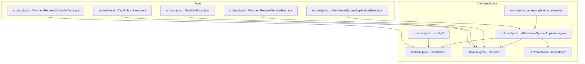
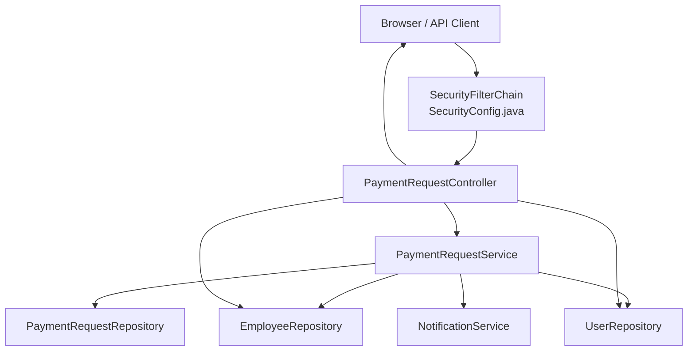
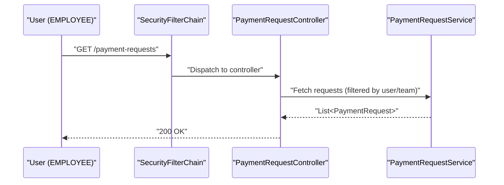
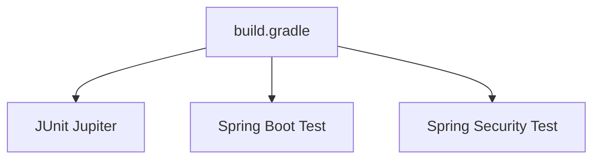

# Testing Strategy

<cite>
**Referenced Files in This Document**
- [AttendanceSystemApplication.java](file://src/main/java/root/cyb/mh/attendancesystem/AttendanceSystemApplication.java)
- [build.gradle](file://build.gradle)
- [settings.gradle](file://settings.gradle)
- [application.properties](file://src/main/resources/application.properties)
- [SecurityConfig.java](file://src/main/java/root/cyb/mh/attendancesystem/config/SecurityConfig.java)
- [PaymentRequestController.java](file://src/main/java/root/cyb/mh/attendancesystem/controller/PaymentRequestController.java)
- [PaymentRequestService.java](file://src/main/java/root/cyb/mh/attendancesystem/service/PaymentRequestService.java)
- [PaymentRequestRepository.java](file://src/main/java/root/cyb/mh/attendancesystem/repository/PaymentRequestRepository.java)
- [AttendanceSystemApplicationTests.java](file://src/test/java/root/cyb/mh/attendancesystem/AttendanceSystemApplicationTests.java)
- [PaymentRequestControllerTest.java](file://src/test/java/root/cyb/mh/attendancesystem/PaymentRequestControllerTest.java)
- [PaymentRequestServiceTest.java](file://src/test/java/root/cyb/mh/attendancesystem/PaymentRequestServiceTest.java)
- [TestCsvParse.java](file://src/test/java/root/cyb/mh/attendancesystem/TestCsvParse.java)
- [TestRobustParse.java](file://src/test/java/root/cyb/mh/attendancesystem/TestRobustParse.java)
</cite>

## Table of Contents
1. [Introduction](#introduction)
2. [Project Structure](#project-structure)
3. [Core Components](#core-components)
4. [Architecture Overview](#architecture-overview)
5. [Detailed Component Analysis](#detailed-component-analysis)
6. [Dependency Analysis](#dependency-analysis)
7. [Performance Considerations](#performance-considerations)
8. [Troubleshooting Guide](#troubleshooting-guide)
9. [Conclusion](#conclusion)
10. [Appendices](#appendices)

## Introduction
This document defines a comprehensive testing strategy for the Skylink Custom Backend. It covers unit testing, integration testing, test data management, mock services, test automation, frameworks, coverage expectations, continuous integration practices, and practical examples drawn from the repository. It also addresses performance, security, and end-to-end testing approaches tailored to the current codebase.

## Project Structure
The project follows a conventional Spring Boot structure with a clear separation between main application code and tests. Tests reside under the standard Gradle layout and leverage Spring Boot’s testing starters and JUnit 5.

**Diagram sources**
- [AttendanceSystemApplication.java:1-16](file://src/main/java/root/cyb/mh/attendancesystem/AttendanceSystemApplication.java#L1-L16)
- [application.properties:1-1](file://src/main/resources/application.properties#L1-L1)

**Section sources**
- [build.gradle:1-60](file://build.gradle#L1-L60)
- [settings.gradle:1-2](file://settings.gradle#L1-L2)

## Core Components
- Application bootstrap and scheduling are configured via the main application class.
- Security is configured with role-based access control and form login.
- Controllers expose HTTP endpoints for payment request management.
- Services encapsulate business logic and orchestrate repositories and external services.
- Repositories define JPA and specification-based queries.

Key testing-relevant components:
- PaymentRequestController: HTTP endpoints with security constraints and business logic.
- PaymentRequestService: Business logic, notifications, sorting, and persistence orchestration.
- PaymentRequestRepository: JPA repository with extensive custom queries and aggregations.

**Section sources**
- [AttendanceSystemApplication.java:1-16](file://src/main/java/root/cyb/mh/attendancesystem/AttendanceSystemApplication.java#L1-L16)
- [SecurityConfig.java:1-91](file://src/main/java/root/cyb/mh/attendancesystem/config/SecurityConfig.java#L1-L91)
- [PaymentRequestController.java:1-688](file://src/main/java/root/cyb/mh/attendancesystem/controller/PaymentRequestController.java#L1-L688)
- [PaymentRequestService.java:1-269](file://src/main/java/root/cyb/mh/attendancesystem/service/PaymentRequestService.java#L1-L269)
- [PaymentRequestRepository.java:1-742](file://src/main/java/root/cyb/mh/attendancesystem/repository/PaymentRequestRepository.java#L1-L742)

## Architecture Overview
The backend uses Spring MVC controllers, service-layer orchestration, and JPA repositories. Security is enforced at the HTTP filter chain level with role-based authorization.

**Diagram sources**
- [SecurityConfig.java:18-84](file://src/main/java/root/cyb/mh/attendancesystem/config/SecurityConfig.java#L18-L84)
- [PaymentRequestController.java:30-688](file://src/main/java/root/cyb/mh/attendancesystem/controller/PaymentRequestController.java#L30-L688)
- [PaymentRequestService.java:14-269](file://src/main/java/root/cyb/mh/attendancesystem/service/PaymentRequestService.java#L14-L269)
- [PaymentRequestRepository.java:10-12](file://src/main/java/root/cyb/mh/attendancesystem/repository/PaymentRequestRepository.java#L10-L12)

## Detailed Component Analysis

### Unit Testing Approach
- Use Spring Boot test slices to isolate components:
  - Service layer: Use @SpringBootTest with @MockitoBean for collaborators.
  - Controller layer: Use @WebMvcTest or @AutoConfigureMockMvc for web layer tests.
- Assertions focus on behavior, not implementation details:
  - Verify repository saves, service notifications, and controller responses.

Practical examples from the repository:
- Service test mocks repository and asserts creation flow.
- Controller test validates endpoint access with @WithMockUser.

**Section sources**
- [PaymentRequestServiceTest.java:1-37](file://src/test/java/root/cyb/mh/attendancesystem/PaymentRequestServiceTest.java#L1-L37)
- [PaymentRequestControllerTest.java:1-34](file://src/test/java/root/cyb/mh/attendancesystem/PaymentRequestControllerTest.java#L1-L34)

### Integration Testing
- Full application context tests validate end-to-end flows:
  - Context load test ensures beans wire correctly.
  - Controller tests exercise HTTP endpoints with security roles.
- Database-backed tests:
  - Repository tests can be added to verify custom queries and aggregations.
  - Consider using an embedded database profile for deterministic tests.

**Section sources**
- [AttendanceSystemApplicationTests.java:1-14](file://src/test/java/root/cyb/mh/attendancesystem/AttendanceSystemApplicationTests.java#L1-L14)
- [PaymentRequestControllerTest.java:20-32](file://src/test/java/root/cyb/mh/attendancesystem/PaymentRequestControllerTest.java#L20-L32)

### Test Data Management
- Current tests rely on in-memory data and mocks.
- For repository-level tests, seed minimal entities via @BeforeEach or test-specific initialization.
- Use separate test profiles and property overrides to control environment behavior.

Recommendations:
- Define a test profile and override datasource to an embedded database.
- Centralize test data builders to reduce duplication and improve readability.

**Section sources**
- [application.properties:1-1](file://src/main/resources/application.properties#L1-L1)
- [build.gradle:46-47](file://build.gradle#L46-L47)

### Mock Services and Stubs
- Use Mockito beans for repositories and external services in service tests.
- For controllers, use MockMvc with @WithMockUser to simulate authenticated users with roles.

Examples:
- PaymentRequestServiceTest mocks PaymentRequestRepository and verifies save and notification invocation.
- PaymentRequestControllerTest uses MockMvc to assert HTTP status codes for protected endpoints.

**Section sources**
- [PaymentRequestServiceTest.java:22-34](file://src/test/java/root/cyb/mh/attendancesystem/PaymentRequestServiceTest.java#L22-L34)
- [PaymentRequestControllerTest.java:17-32](file://src/test/java/root/cyb/mh/attendancesystem/PaymentRequestControllerTest.java#L17-L32)

### Test Automation and Continuous Integration
- Gradle test task configured to use JUnit Platform.
- CI pipeline should:
  - Run unit and integration tests.
  - Use a dedicated test database container.
  - Publish test results and coverage (if added).
  - Enforce branch protection and pre-merge checks.

**Section sources**
- [build.gradle:57-59](file://build.gradle#L57-L59)

### Practical Examples

#### Example: Service Layer Test
- Scenario: Creating a payment request as a user or employee.
- Steps:
  - Create a PaymentRequest and User/Employee.
  - Inject repository mock returning the saved entity.
  - Invoke service method and assert non-null result.

**Section sources**
- [PaymentRequestServiceTest.java:25-35](file://src/test/java/root/cyb/mh/attendancesystem/PaymentRequestServiceTest.java#L25-L35)

#### Example: Controller Layer Test
- Scenario: Accessing payment requests list with ADMIN vs EMPLOYEE roles.
- Steps:
  - Configure MockMvc.
  - Perform GET with @WithMockUser for each role.
  - Assert HTTP 200 OK.

**Section sources**
- [PaymentRequestControllerTest.java:20-32](file://src/test/java/root/cyb/mh/attendancesystem/PaymentRequestControllerTest.java#L20-L32)

#### Example: CSV Parsing and Robustness Testing
- Scenario: Validating invoice date parsing robustness across formats.
- Steps:
  - Provide varied inputs (MM-dd-yy, M-d-yy, whitespace, Unicode spaces).
  - Assert successful parsing or failure depending on expectations.

**Section sources**
- [TestRobustParse.java:11-34](file://src/test/java/root/cyb/mh/attendancesystem/TestRobustParse.java#L11-L34)
- [TestCsvParse.java:14-68](file://src/test/java/root/cyb/mh/attendancesystem/TestCsvParse.java#L14-L68)

### Security Testing
- Role-based access control:
  - ADMIN routes require ADMIN role.
  - HR routes require ADMIN or HR.
  - Employee routes require EMPLOYEE role.
- Test coverage:
  - Verify forbidden responses for unauthorized roles.
  - Validate success for authorized roles.

**Diagram sources**
- [SecurityConfig.java:27-49](file://src/main/java/root/cyb/mh/attendancesystem/config/SecurityConfig.java#L27-L49)
- [PaymentRequestController.java:65-147](file://src/main/java/root/cyb/mh/attendancesystem/controller/PaymentRequestController.java#L65-L147)

**Section sources**
- [SecurityConfig.java:18-84](file://src/main/java/root/cyb/mh/attendancesystem/config/SecurityConfig.java#L18-L84)
- [PaymentRequestControllerTest.java:20-32](file://src/test/java/root/cyb/mh/attendancesystem/PaymentRequestControllerTest.java#L20-L32)

### Performance Testing
- Load and stress tests:
  - Use synthetic traffic against controller endpoints.
  - Monitor response times and error rates.
- Database performance:
  - Benchmark repository queries with realistic datasets.
  - Use connection pooling and optimize slow queries identified by logs.

[No sources needed since this section provides general guidance]

### End-to-End Testing
- UI-driven tests:
  - Use browser automation (e.g., Selenium) to validate full user journeys.
- API contract tests:
  - Validate request/response schemas and status codes.
- Data integrity:
  - Verify audit fields, timestamps, and cascading updates.

[No sources needed since this section provides general guidance]

## Dependency Analysis
The testing stack leverages Spring Boot Test and Spring Security Test. Dependencies are declared in Gradle.

**Diagram sources**
- [build.gradle:52-54](file://build.gradle#L52-L54)

**Section sources**
- [build.gradle:1-60](file://build.gradle#L1-L60)

## Performance Considerations
- Prefer lightweight tests:
  - Use @MockitoBean for heavy collaborators.
  - Minimize real database round-trips in unit tests.
- Profile slow tests:
  - Identify hotspots in service methods and repository queries.
- Optimize repository queries:
  - Use projections and pagination for large datasets.
  - Add indexes for frequently filtered columns.

[No sources needed since this section provides general guidance]

## Troubleshooting Guide
Common issues and resolutions:
- Unauthorized access errors:
  - Ensure @WithMockUser roles match controller security constraints.
- CSRF-related failures:
  - Confirm CSRF behavior aligns with form usage; adjust configuration if needed.
- Database connectivity in tests:
  - Use test profile with embedded database or Dockerized Postgres.
- Timezone-sensitive assertions:
  - Set JVM timezone consistently in tests or use fixed offsets.

**Section sources**
- [SecurityConfig.java:81-81](file://src/main/java/root/cyb/mh/attendancesystem/config/SecurityConfig.java#L81-L81)
- [application.properties:1-1](file://src/main/resources/application.properties#L1-L1)

## Conclusion
The current repository demonstrates foundational testing patterns with service and controller tests, CSV parsing utilities, and a basic application context test. To mature the testing strategy:
- Expand repository tests with seeded data and assertions.
- Introduce API contract and UI automation tests.
- Establish CI pipelines with test databases and coverage reporting.
- Enforce security and performance test gates.

[No sources needed since this section summarizes without analyzing specific files]

## Appendices

### Test Coverage Requirements
- Target: Service layer 80%+, Repository layer 70%+, Integration tests covering critical flows.
- Coverage tools: Jacoco or similar can be integrated via Gradle.

[No sources needed since this section provides general guidance]

### Continuous Integration Practices
- Trigger: On push to main and pull requests.
- Steps: Build, test, lint, and publish artifacts.
- Databases: Use ephemeral Postgres containers for integration tests.

[No sources needed since this section provides general guidance]