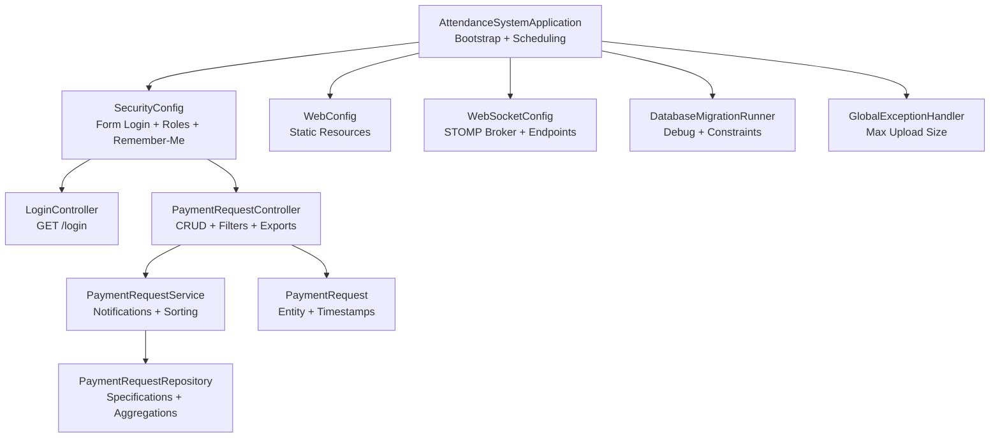
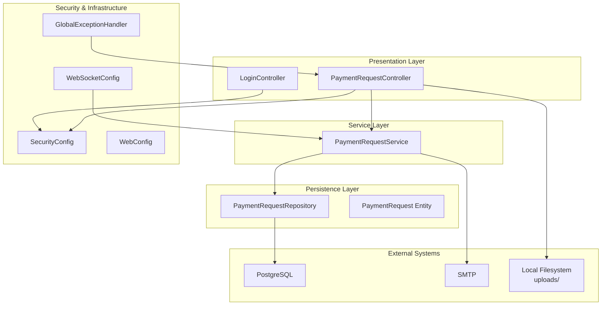
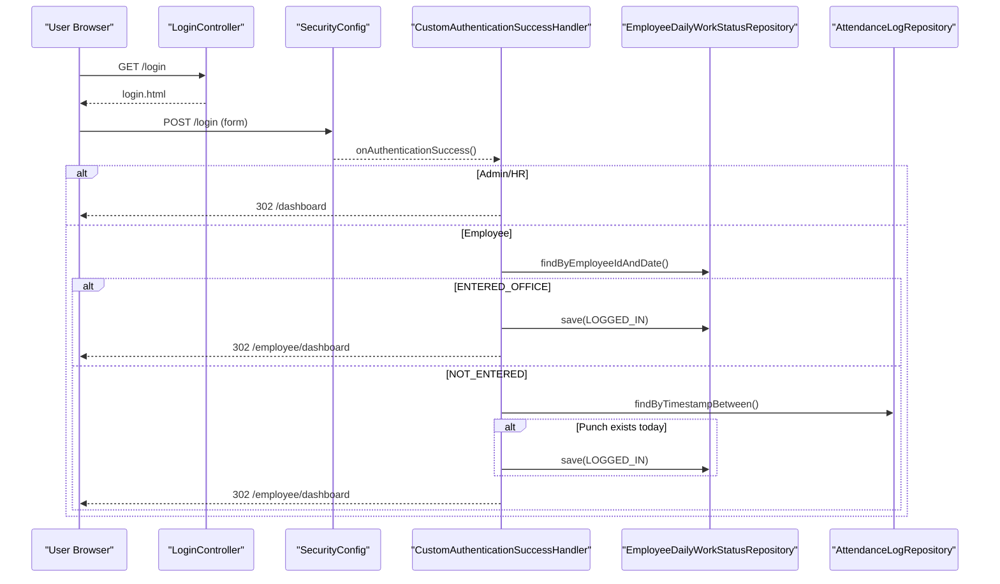
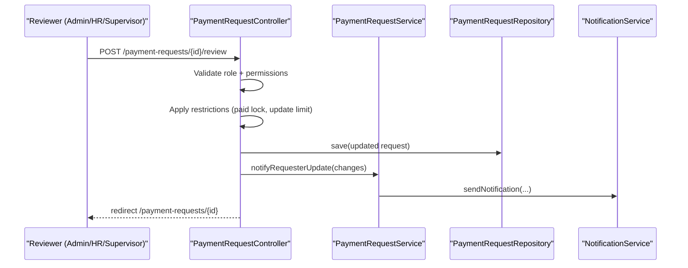
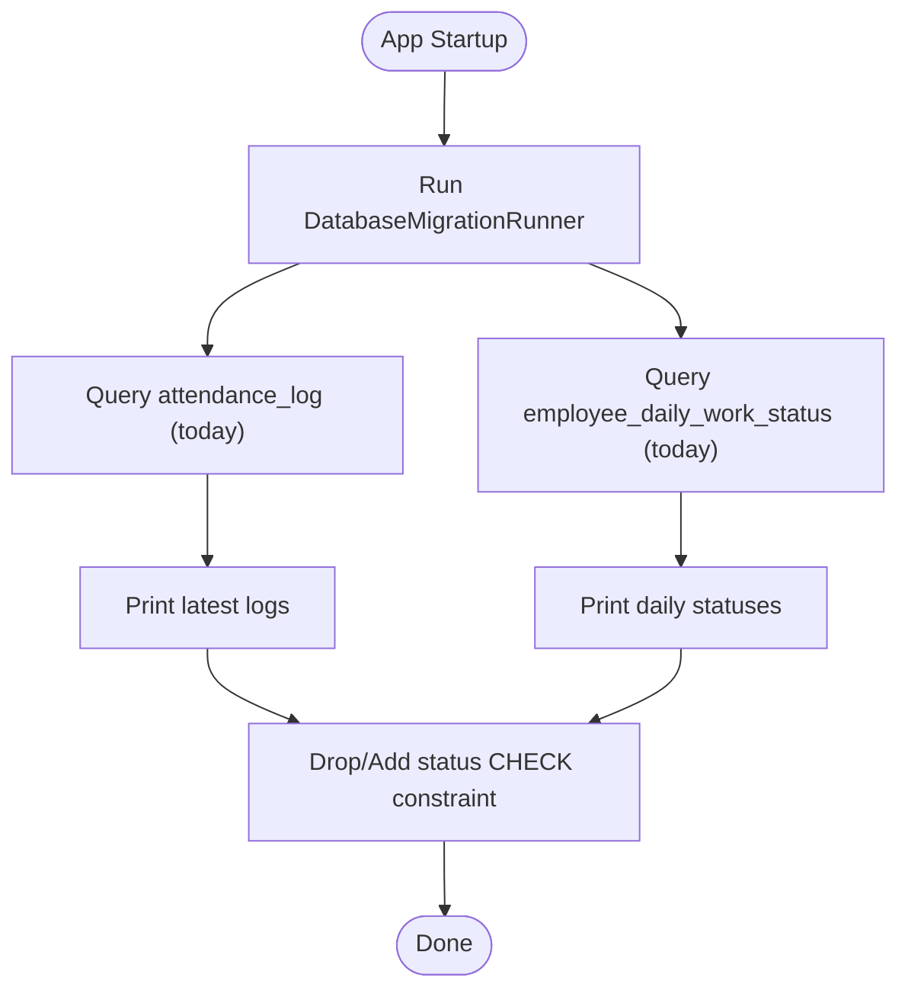
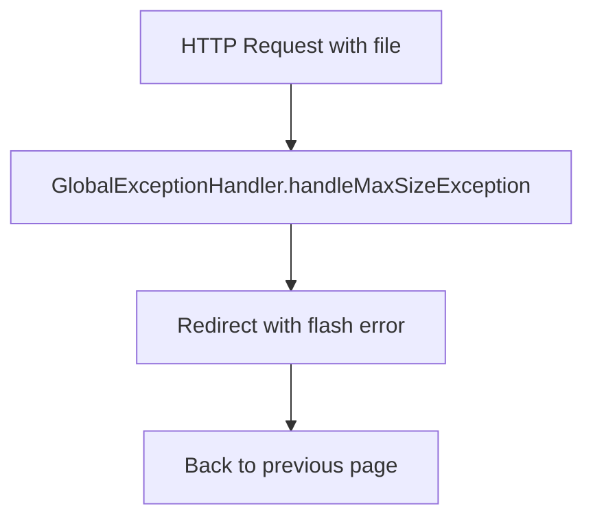
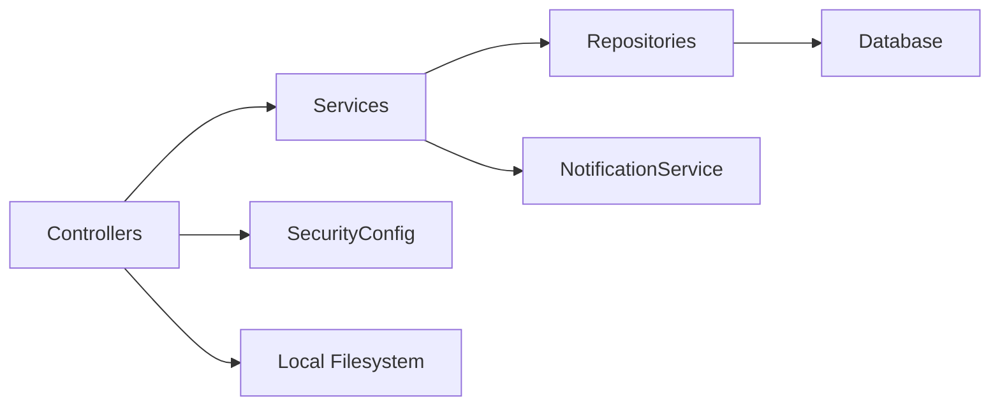

# Troubleshooting and FAQ

<cite>
**Referenced Files in This Document**
- [AttendanceSystemApplication.java](file://src/main/java/root/cyb/mh/attendancesystem/AttendanceSystemApplication.java)
- [SecurityConfig.java](file://src/main/java/root/cyb/mh/attendancesystem/config/SecurityConfig.java)
- [CustomAuthenticationSuccessHandler.java](file://src/main/java/root/cyb/mh/attendancesystem/config/CustomAuthenticationSuccessHandler.java)
- [WebConfig.java](file://src/main/java/root/cyb/mh/attendancesystem/config/WebConfig.java)
- [WebSocketConfig.java](file://src/main/java/root/cyb/mh/attendancesystem/config/WebSocketConfig.java)
- [DatabaseMigrationRunner.java](file://src/main/java/root/cyb/mh/attendancesystem/config/DatabaseMigrationRunner.java)
- [GlobalExceptionHandler.java](file://src/main/java/root/cyb/mh/attendancesystem/exception/GlobalExceptionHandler.java)
- [LoginController.java](file://src/main/java/root/cyb/mh/attendancesystem/controller/LoginController.java)
- [PaymentRequestController.java](file://src/main/java/root/cyb/mh/attendancesystem/controller/PaymentRequestController.java)
- [PaymentRequestService.java](file://src/main/java/root/cyb/mh/attendancesystem/service/PaymentRequestService.java)
- [PaymentRequestRepository.java](file://src/main/java/root/cyb/mh/attendancesystem/repository/PaymentRequestRepository.java)
- [PaymentRequest.java](file://src/main/java/root/cyb/mh/attendancesystem/model/PaymentRequest.java)
- [application.properties](file://src/main/resources/application.properties)
- [application-dev.properties](file://src/main/resources/application-dev.properties)
- [application-prod.properties](file://src/main/resources/application-prod.properties)
</cite>

## Table of Contents
1. [Introduction](#introduction)
2. [Project Structure](#project-structure)
3. [Core Components](#core-components)
4. [Architecture Overview](#architecture-overview)
5. [Detailed Component Analysis](#detailed-component-analysis)
6. [Dependency Analysis](#dependency-analysis)
7. [Performance Considerations](#performance-considerations)
8. [Troubleshooting Guide](#troubleshooting-guide)
9. [FAQ](#faq)
10. [Conclusion](#conclusion)

## Introduction
This document provides comprehensive troubleshooting and FAQ guidance for the Skylink Custom Backend. It focuses on diagnosing common issues, optimizing performance, debugging techniques, resolving errors, and establishing best practices. It also covers frequently asked questions about system behavior, configuration, integration, and user workflows.

## Project Structure
The backend is a Spring Boot application with layered architecture:
- Application bootstrap and scheduling enablement
- Security configuration (form login, role-based access, remember-me)
- MVC and static resource serving
- WebSocket support for real-time notifications
- Controllers for business features (e.g., payment requests)
- Services implementing business logic and notifications
- Repositories with extensive JPA and Specification-based queries
- Global exception handling for file upload limits
- Environment-specific configuration profiles

**Diagram sources**
- [AttendanceSystemApplication.java:1-16](file://src/main/java/root/cyb/mh/attendancesystem/AttendanceSystemApplication.java#L1-L16)
- [SecurityConfig.java:1-91](file://src/main/java/root/cyb/mh/attendancesystem/config/SecurityConfig.java#L1-L91)
- [WebConfig.java:1-18](file://src/main/java/root/cyb/mh/attendancesystem/config/WebConfig.java#L1-L18)
- [WebSocketConfig.java:1-26](file://src/main/java/root/cyb/mh/attendancesystem/config/WebSocketConfig.java#L1-L26)
- [DatabaseMigrationRunner.java:1-43](file://src/main/java/root/cyb/mh/attendancesystem/config/DatabaseMigrationRunner.java#L1-L43)
- [LoginController.java:1-14](file://src/main/java/root/cyb/mh/attendancesystem/controller/LoginController.java#L1-L14)
- [PaymentRequestController.java:1-688](file://src/main/java/root/cyb/mh/attendancesystem/controller/PaymentRequestController.java#L1-L688)
- [PaymentRequestService.java:1-269](file://src/main/java/root/cyb/mh/attendancesystem/service/PaymentRequestService.java#L1-L269)
- [PaymentRequestRepository.java:1-742](file://src/main/java/root/cyb/mh/attendancesystem/repository/PaymentRequestRepository.java#L1-L742)
- [PaymentRequest.java:1-117](file://src/main/java/root/cyb/mh/attendancesystem/model/PaymentRequest.java#L1-L117)
- [GlobalExceptionHandler.java:1-27](file://src/main/java/root/cyb/mh/attendancesystem/exception/GlobalExceptionHandler.java#L1-L27)

**Section sources**
- [AttendanceSystemApplication.java:1-16](file://src/main/java/root/cyb/mh/attendancesystem/AttendanceSystemApplication.java#L1-L16)
- [application.properties:1-1](file://src/main/resources/application.properties#L1-L1)
- [application-dev.properties:1-33](file://src/main/resources/application-dev.properties#L1-L33)
- [application-prod.properties:1-33](file://src/main/resources/application-prod.properties#L1-L33)

## Core Components
- Application bootstrap enables scheduling and starts the server.
- SecurityConfig defines form login, role-based authorization, remember-me, and CSRF policy.
- CustomAuthenticationSuccessHandler redirects users to appropriate dashboards and performs daily work status healing logic.
- WebConfig exposes local uploads directory for static resource serving.
- WebSocketConfig sets up a simple broker for topics/queues and a SockJS endpoint.
- GlobalExceptionHandler centralizes handling of file size limit exceeded scenarios.
- PaymentRequestController orchestrates listing, filtering, creation, review, exports, and invoice generation.
- PaymentRequestService encapsulates request lifecycle, notifications, and sorting logic.
- PaymentRequestRepository provides JPA and Specification-based queries plus rich aggregations.
- PaymentRequest entity manages timestamps, relations, and statuses.

**Section sources**
- [SecurityConfig.java:18-84](file://src/main/java/root/cyb/mh/attendancesystem/config/SecurityConfig.java#L18-L84)
- [CustomAuthenticationSuccessHandler.java:27-64](file://src/main/java/root/cyb/mh/attendancesystem/config/CustomAuthenticationSuccessHandler.java#L27-L64)
- [WebConfig.java:10-16](file://src/main/java/root/cyb/mh/attendancesystem/config/WebConfig.java#L10-L16)
- [WebSocketConfig.java:13-24](file://src/main/java/root/cyb/mh/attendancesystem/config/WebSocketConfig.java#L13-L24)
- [GlobalExceptionHandler.java:12-25](file://src/main/java/root/cyb/mh/attendancesystem/exception/GlobalExceptionHandler.java#L12-L25)
- [PaymentRequestController.java:65-147](file://src/main/java/root/cyb/mh/attendancesystem/controller/PaymentRequestController.java#L65-L147)
- [PaymentRequestService.java:29-60](file://src/main/java/root/cyb/mh/attendancesystem/service/PaymentRequestService.java#L29-L60)
- [PaymentRequestRepository.java:10-12](file://src/main/java/root/cyb/mh/attendancesystem/repository/PaymentRequestRepository.java#L10-L12)
- [PaymentRequest.java:25-31](file://src/main/java/root/cyb/mh/attendancesystem/model/PaymentRequest.java#L25-L31)

## Architecture Overview
The system follows a layered Spring MVC + Spring Data + Spring Security architecture with optional real-time messaging via WebSocket.

**Diagram sources**
- [LoginController.java:1-14](file://src/main/java/root/cyb/mh/attendancesystem/controller/LoginController.java#L1-L14)
- [PaymentRequestController.java:1-688](file://src/main/java/root/cyb/mh/attendancesystem/controller/PaymentRequestController.java#L1-L688)
- [PaymentRequestService.java:1-269](file://src/main/java/root/cyb/mh/attendancesystem/service/PaymentRequestService.java#L1-L269)
- [PaymentRequestRepository.java:1-742](file://src/main/java/root/cyb/mh/attendancesystem/repository/PaymentRequestRepository.java#L1-L742)
- [SecurityConfig.java:18-84](file://src/main/java/root/cyb/mh/attendancesystem/config/SecurityConfig.java#L18-L84)
- [WebSocketConfig.java:13-24](file://src/main/java/root/cyb/mh/attendancesystem/config/WebSocketConfig.java#L13-L24)
- [WebConfig.java:10-16](file://src/main/java/root/cyb/mh/attendancesystem/config/WebConfig.java#L10-L16)
- [GlobalExceptionHandler.java:12-25](file://src/main/java/root/cyb/mh/attendancesystem/exception/GlobalExceptionHandler.java#L12-L25)

## Detailed Component Analysis

### Authentication and Authorization Flow
This sequence illustrates login, role-based redirection, and daily work status healing for employees.

**Diagram sources**
- [LoginController.java:9-12](file://src/main/java/root/cyb/mh/attendancesystem/controller/LoginController.java#L9-L12)
- [SecurityConfig.java:50-60](file://src/main/java/root/cyb/mh/attendancesystem/config/SecurityConfig.java#L50-L60)
- [CustomAuthenticationSuccessHandler.java:27-64](file://src/main/java/root/cyb/mh/attendancesystem/config/CustomAuthenticationSuccessHandler.java#L27-L64)

**Section sources**
- [SecurityConfig.java:18-84](file://src/main/java/root/cyb/mh/attendancesystem/config/SecurityConfig.java#L18-L84)
- [CustomAuthenticationSuccessHandler.java:27-64](file://src/main/java/root/cyb/mh/attendancesystem/config/CustomAuthenticationSuccessHandler.java#L27-L64)

### Payment Request Review Workflow
This flow outlines the review process, restrictions for non-admin users, and notification triggers.

**Diagram sources**
- [PaymentRequestController.java:333-517](file://src/main/java/root/cyb/mh/attendancesystem/controller/PaymentRequestController.java#L333-L517)
- [PaymentRequestService.java:164-204](file://src/main/java/root/cyb/mh/attendancesystem/service/PaymentRequestService.java#L164-L204)

**Section sources**
- [PaymentRequestController.java:333-517](file://src/main/java/root/cyb/mh/attendancesystem/controller/PaymentRequestController.java#L333-L517)
- [PaymentRequestService.java:164-204](file://src/main/java/root/cyb/mh/attendancesystem/service/PaymentRequestService.java#L164-L204)

### Database Migration and Debugging
The migration runner prints recent attendance logs and current-day work statuses, and re-applies a constraint to ensure data integrity.

**Diagram sources**
- [DatabaseMigrationRunner.java:14-41](file://src/main/java/root/cyb/mh/attendancesystem/config/DatabaseMigrationRunner.java#L14-L41)

**Section sources**
- [DatabaseMigrationRunner.java:14-41](file://src/main/java/root/cyb/mh/attendancesystem/config/DatabaseMigrationRunner.java#L14-L41)

### File Upload Size Limit Handling
Global exception handling captures oversized uploads and redirects back to the referring page with an error message.

**Diagram sources**
- [GlobalExceptionHandler.java:12-25](file://src/main/java/root/cyb/mh/attendancesystem/exception/GlobalExceptionHandler.java#L12-L25)

**Section sources**
- [GlobalExceptionHandler.java:12-25](file://src/main/java/root/cyb/mh/attendancesystem/exception/GlobalExceptionHandler.java#L12-L25)

## Dependency Analysis
- Controllers depend on services and repositories.
- Services depend on repositories and external services (notifications, mail).
- Repositories depend on JPA and Specification APIs.
- Security configuration governs access to controllers.
- WebSocket configuration enables real-time communication channels.

**Diagram sources**
- [PaymentRequestController.java:1-688](file://src/main/java/root/cyb/mh/attendancesystem/controller/PaymentRequestController.java#L1-L688)
- [PaymentRequestService.java:1-269](file://src/main/java/root/cyb/mh/attendancesystem/service/PaymentRequestService.java#L1-L269)
- [PaymentRequestRepository.java:1-742](file://src/main/java/root/cyb/mh/attendancesystem/repository/PaymentRequestRepository.java#L1-L742)
- [SecurityConfig.java:18-84](file://src/main/java/root/cyb/mh/attendancesystem/config/SecurityConfig.java#L18-L84)

**Section sources**
- [PaymentRequestController.java:1-688](file://src/main/java/root/cyb/mh/attendancesystem/controller/PaymentRequestController.java#L1-L688)
- [PaymentRequestService.java:1-269](file://src/main/java/root/cyb/mh/attendancesystem/service/PaymentRequestService.java#L1-L269)
- [PaymentRequestRepository.java:1-742](file://src/main/java/root/cyb/mh/attendancesystem/repository/PaymentRequestRepository.java#L1-L742)
- [SecurityConfig.java:18-84](file://src/main/java/root/cyb/mh/attendancesystem/config/SecurityConfig.java#L18-L84)

## Performance Considerations
- Database queries: The repository contains numerous aggregation and analytical queries. Use pagination and indexes on frequently filtered columns (requestDate, status, paymentStatus, priority).
- Sorting: Sorting by lastModified may be expensive without proper indexing; consider adding composite indexes.
- Notifications: Sending notifications inside tight loops can increase latency; batch or offload where possible.
- File uploads: Enforce size limits and stream large files to reduce memory pressure.
- WebSocket: Keep message payloads minimal; use targeted destinations to reduce broker overhead.
- Sessions: Session timeout is configured; ensure session storage aligns with deployment scale.

[No sources needed since this section provides general guidance]

## Troubleshooting Guide

### 1) Login and Role-Based Access Issues
Symptoms:
- Users redirected to unexpected pages after login.
- Employees not auto-updated to LOGGED_IN despite ADMS punches.

Diagnosis steps:
- Verify form login configuration and success handler redirection logic.
- Confirm daily work status healing logic checks attendance logs for today’s punches.
- Check remember-me configuration and cookie availability.

Resolution:
- Adjust success handler logic if custom redirection is required.
- Ensure attendance log timestamps fall within the current day boundaries.

**Section sources**
- [SecurityConfig.java:50-60](file://src/main/java/root/cyb/mh/attendancesystem/config/SecurityConfig.java#L50-L60)
- [CustomAuthenticationSuccessHandler.java:32-64](file://src/main/java/root/cyb/mh/attendancesystem/config/CustomAuthenticationSuccessHandler.java#L32-L64)

### 2) Payment Request Review Restrictions
Symptoms:
- Non-admin users cannot change certain fields after payment is marked PAID.
- Update limit reached errors occur unexpectedly.

Diagnosis steps:
- Review restriction logic for PAID requests and update counts.
- Check system setting for review update limit.
- Inspect notification messages for error codes.

Resolution:
- Relax or adjust update limits via system settings.
- Ensure approver identity is correctly captured for admin vs. supervisor actions.

**Section sources**
- [PaymentRequestController.java:385-425](file://src/main/java/root/cyb/mh/attendancesystem/controller/PaymentRequestController.java#L385-L425)
- [PaymentRequestController.java:414-424](file://src/main/java/root/cyb/mh/attendancesystem/controller/PaymentRequestController.java#L414-L424)

### 3) File Upload Size Exceeded
Symptoms:
- Redirected back to the previous page with an error message indicating file too large.

Diagnosis steps:
- Confirm multipart limits in environment properties.
- Check referer header handling in the global exception handler.

Resolution:
- Increase multipart limits if necessary.
- Ensure UI provides clear feedback before upload.

**Section sources**
- [application-dev.properties:27-29](file://src/main/resources/application-dev.properties#L27-L29)
- [application-prod.properties:27-29](file://src/main/resources/application-prod.properties#L27-L29)
- [GlobalExceptionHandler.java:12-25](file://src/main/java/root/cyb/mh/attendancesystem/exception/GlobalExceptionHandler.java#L12-L25)

### 4) Static Resource Serving (Uploads)
Symptoms:
- Files under uploads cannot be served or accessed.

Diagnosis steps:
- Verify WebConfig resource handler mapping to uploads directory.
- Confirm filesystem permissions and directory existence.

Resolution:
- Ensure the uploads directory exists and is writable.
- Adjust resource locations if deployed outside the working directory.

**Section sources**
- [WebConfig.java:10-16](file://src/main/java/root/cyb/mh/attendancesystem/config/WebConfig.java#L10-L16)

### 5) WebSocket Real-Time Notifications
Symptoms:
- Clients cannot connect to WebSocket endpoint or receive messages.

Diagnosis steps:
- Confirm WebSocketConfig endpoint registration and broker configuration.
- Check browser console for SockJS connection errors.
- Validate user destination prefixes and topic routing.

Resolution:
- Ensure clients connect to the registered endpoint.
- Use user-specific destinations for targeted messages.

**Section sources**
- [WebSocketConfig.java:13-24](file://src/main/java/root/cyb/mh/attendancesystem/config/WebSocketConfig.java#L13-L24)

### 6) Database Integrity and Debugging
Symptoms:
- Unexpected status values or constraint violations.

Diagnosis steps:
- Review migration runner logs for recent attendance and status rows.
- Check constraint re-application logic.

Resolution:
- Rerun migrations or manually apply constraints if needed.
- Monitor logs for recurring failures.

**Section sources**
- [DatabaseMigrationRunner.java:14-41](file://src/main/java/root/cyb/mh/attendancesystem/config/DatabaseMigrationRunner.java#L14-L41)

### 7) Invoice Generation and Email Delivery
Symptoms:
- Invoice PDF not generated or email fails to send.

Diagnosis steps:
- Verify permission checks for invoice access.
- Confirm payment status is PAID before generating invoices.
- Check SMTP configuration and credentials.

Resolution:
- Ensure request meets invoice criteria (PAID).
- Validate email service configuration and network connectivity.

**Section sources**
- [PaymentRequestController.java:539-582](file://src/main/java/root/cyb/mh/attendancesystem/controller/PaymentRequestController.java#L539-L582)
- [application-dev.properties:19-25](file://src/main/resources/application-dev.properties#L19-L25)
- [application-prod.properties:19-25](file://src/main/resources/application-prod.properties#L19-L25)

### 8) Logging and Log Analysis Techniques
Recommended practices:
- Enable appropriate logging levels for controllers, services, and repositories.
- Correlate request IDs with database queries and external service calls.
- Use structured logging for audit trails (timestamps, user roles, action outcomes).

[No sources needed since this section provides general guidance]

### 9) Escalation Procedures
Escalation path:
- Tier 1: Validate environment configuration and basic connectivity.
- Tier 2: Inspect logs, run database diagnostics, and reproduce with test data.
- Tier 3: Review third-party integrations (mail, file system), and performance profiling.

[No sources needed since this section provides general guidance]

## FAQ

Q1: Why is my status not auto-updated to LOGGED_IN after punching?
- Ensure today’s attendance logs exist and match the employee ID.
- Confirm the daily work status record exists for the current date.

Q2: How do I change the maximum file upload size?
- Modify multipart limits in the active profile properties.

Q3: Why can’t I connect to the WebSocket endpoint?
- Verify the endpoint registration and that clients use SockJS.
- Check browser console for connection errors.

Q4: Why does the review page show “Update Limit Reached”?
- The system enforces a configurable limit for non-admin reviewers.
- Adjust the limit via system settings if needed.

Q5: How do I export payment requests?
- Use the export endpoint with CSV or PDF format and selected columns.

Q6: Why is my invoice not available?
- Invoices are only available for PAID requests.
- Ensure you have permission to access the request.

Q7: How are notifications triggered?
- Notifications are sent when requests change status or payment status.
- Review the notification logic in the service layer.

Q8: How do I serve uploaded proof files?
- Uploads are stored under the uploads directory and served via a resource handler.

Q9: How do I debug database constraints?
- Use the migration runner logs to inspect current-day statuses and logs.
- Confirm constraint re-application.

Q10: How do I configure SMTP for emails?
- Set host, port, username, password, and TLS properties in the active profile.

**Section sources**
- [CustomAuthenticationSuccessHandler.java:32-64](file://src/main/java/root/cyb/mh/attendancesystem/config/CustomAuthenticationSuccessHandler.java#L32-L64)
- [application-dev.properties:27-29](file://src/main/resources/application-dev.properties#L27-L29)
- [application-prod.properties:27-29](file://src/main/resources/application-prod.properties#L27-L29)
- [WebSocketConfig.java:13-24](file://src/main/java/root/cyb/mh/attendancesystem/config/WebSocketConfig.java#L13-L24)
- [PaymentRequestController.java:149-194](file://src/main/java/root/cyb/mh/attendancesystem/controller/PaymentRequestController.java#L149-L194)
- [PaymentRequestController.java:539-582](file://src/main/java/root/cyb/mh/attendancesystem/controller/PaymentRequestController.java#L539-L582)
- [PaymentRequestService.java:92-125](file://src/main/java/root/cyb/mh/attendancesystem/service/PaymentRequestService.java#L92-L125)
- [WebConfig.java:10-16](file://src/main/java/root/cyb/mh/attendancesystem/config/WebConfig.java#L10-L16)
- [DatabaseMigrationRunner.java:14-41](file://src/main/java/root/cyb/mh/attendancesystem/config/DatabaseMigrationRunner.java#L14-L41)
- [application-dev.properties:19-25](file://src/main/resources/application-dev.properties#L19-L25)
- [application-prod.properties:19-25](file://src/main/resources/application-prod.properties#L19-L25)

## Conclusion
This guide consolidates practical troubleshooting steps, performance tips, and FAQs for the Skylink Custom Backend. By following the diagnostic flows, adjusting configurations, and applying the recommended best practices, most operational issues can be resolved efficiently while maintaining system stability and performance.